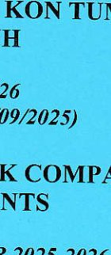
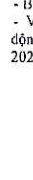
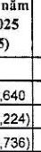
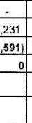
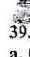
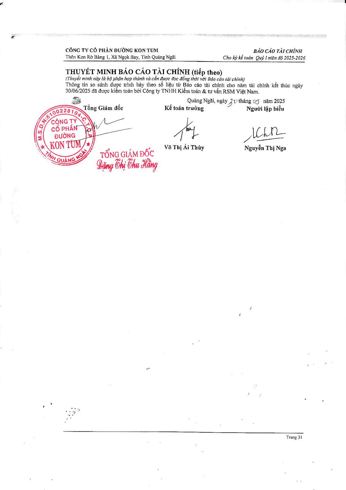

CÔNG TY CỔ PHẦN ĐƯỜNG KON TUM
BÁO CÁO TÀI CHÍNH 

QUÝ I NIÊN ĐỘ 2025-2026
(TỪ NGÀY 01/07/2025 ĐẾN 30/09/2025) 

KON TUM SUGAR JOINT STOCK COMPANY
FINANCIAL STATEMENTS 

QUARTER I ACCOUNTING YEAR 2025-2026
(FROM 01/07/2025 TO 30/09/2025) 

 

CÔNG TY CỔ PHẦN ĐƯỜNG KON TUM 

Địa chỉ mới : Thôn Kon Rò Bàng 1, xã Ngọk Bay, tỉnh Quảng Ngãi.
Điện thoại : 0260.6289549 ; Fax : 0260.3916168 

KON TUM SUGAR JOINT STOCK COMPANY
Address: Kon Ro Bang 1 Village, Ngok Bay Commune, Quang Ngai Province. 

Tel: 0260.6289549 ; Fax : 0260.3916168

<--- Page Split --->

Số: A/CV-KTS (V/v: Báo cáo tài chính Quý 1/2025- 2026 - kỳ hoạt động từ ngày 01/07/2025 đến 30/09/2025) 

Quảng Ngãi, ngày 20. tháng 10. năm 2025 

CÔNG BỐ THÔNG TIN ĐỊNH KỲ BÁO CÁO TÀI CHÍNH 

Kính gửi: Sở Giao dịch Chứng khoán Hà Nội 

Thực hiện quy định tại khoản 3 Điều 14 Thông tư số 96/2020/TT-BTC ngày 16/11/2020 của Bộ Tài chính hướng dẫn công bố thông tin trên thị trường chứng khoán, Công ty cổ phần Đường Kon Tum thực hiện công bố thông tin báo cáo tài chính (BCTC) Quý I Năm 2025-2026 với Sở Giao dịch Chứng khoán Hà Nội như sau: 

1. Tên công ty : Công ty CP Đường Kon Tum 

- Mã chứng khoán: KTS 

- Địa chỉ: Thôn Kon Rò Bàng 1, Xã Ngọk Bay, Tỉnh Quảng Ngãi 

- Điện thoại liên hệ: Tel: 02606.289549 Fax: 02603.916168 

- Email: ctyduongkontum@yahoo.com.vn ; Website : ktsduongkontum.vn 

BCTC Quý I/năm 2025-2026 (từ 01/07/2025 đến 30/09/2025)
x BCTC riêng (TCNY không có công ty con và đơn vị kế toán cấp trên có đơn vị trực thuộc); 

BCTC hợp nhất (TCNY có công ty con);
BCTC tổng hợp (TCNY có đơn vị kế toán trực thuộc tổ chức bộ máy kế toán riêng). 

- Các trường hợp thuộc diện phải giải trình nguyên nhân: 

+ Tổ chức kiểm toán đưa ra ý kiến không phải là ý kiến chấp nhận toàn phần đối với BCTC (đối với BCTC được kiểm toán năm 2024): 

Có 

Không 

Văn bản giải trình trong trường hợp tích có: 

Có 

Không

<--- Page Split --->

+ Lợi nhuận sau thuế trong kỳ báo cáo có sự chênh lệch trước và sau kiểm toán từ 5% trở lên, chuyển từ lỗ sang lãi hoặc ngược lại (đối với BCTC được kiểm toán năm 2024): 

 

 

Văn bản giải trình trong trường hợp tích có: 

 

 

+ Lợi nhuận sau thế thu nhập doanh nghiệp tại báo cáo kết quả kinh doanh của kỳ báo cáo thay đổi từ 10% trở lên so với báo cáo cùng kỳ năm trước: 

 

 

Văn bản giải trình trong trường hợp tích có: 

 

 

+ Lợi nhuận sau thuế trong kỳ báo cáo bị lỗ, chuyển từ lãi ở báo cáo cùng kỳ năm trước sang lỗ ở kỳ này hoặc ngược lại: 

 

 

Văn bản giải trình trong trường hợp tích có: 

 

 

Thông tin này đã được công bố trên trang thông tin điện tử của công ty vào ngày: 20.10/2025 tại đường dẫn Website : ktsduongkontum.vn/Quan hệ cổ đông. 

Chúng tôi xin cam kết các thông tin công bố trên đây là đúng sự thật và hoàn toàn chịu trách nhiệm trước pháp luật về nội dung các thông tin công bố. 

CÔNG TY CỔ PHẦN ĐƯỜNG KONTUM 

Tài liệu đính kèm: 

- BCTC Qúy 1 năm 2025-2026
- Văn bản giải trình kết quả hoạt động kinh doanh Quý 1 niên độ 2025-2026 

<--- Page Split --->

CÔNG TY CỔ PHẦN
ĐƯỜNG KON TUM 

Số 1/9 /KTS 

V/v: "Giải trình kết quả hoạt động kinh
doanh Quý 1 niên độ 2025-2026" 

CỘNG HÒA XÃ HỘI CHỦ NGHĨA VIỆT NAM
Độc lập - Tự do - Hạnh phúc 

Quảng Ngãi, ngày 20 tháng 10 năm 2025 

Kính gửi: 

- ỦY BAN CHỨNG KHOÁN NHÀ NƯỚC (SSC) 

- SỞ GIAO DỊCH CHỨNG KHOÁN HÀ NỘI (HNX) 

- CÁC NHÀ ĐẦU TƯ 

Tên doanh nghiệp: Công ty Cổ Phần Đường Kon Tum 

Mã chứng khoán: KTS 

Địa chỉ: Thôn Kon Rò Bàng 1, Xã Ngọk Bay, Tỉnh Quảng Ngãi 

- Căn cứ Thông tư số 96/2020/TT-BTC ngày 16 tháng 11 năm 2020 của Bộ tài chính
hướng dẫn về việc công bố thông tin trên thị trường chứng khoán. 

- Căn cứ Báo cáo kết quả kinh doanh từ ngày 01/07/2024 đến 30/09/2024 

- Căn cứ Báo cáo kết quả kinh doanh từ ngày 01/07/2025 đến 30/09/2025 

Công ty Cổ Phần Đường Kon Tum giải trình về sự biến động tăng, giảm của kết quả
hoạt động kinh doanh Quý 1 niên độ 2025-2026 so với kết quả hoạt động kinh doanh Quý 1 niên
độ 2024-2025 như sau: 

Đơn vị tính: VNĐ 

<table><tr><td>Nội dung</td><td>Quý I/2024-2025 (Từ 01/07/2024 đến 30/09/2024)</td><td>Quý I/2025-2026 (Từ 01/07/2025 đến 30/09/2025)</td><td>Tăng/giảm (+/-)</td><td>% tăng/giảm</td></tr><tr><td>Lợi nhuận sau thuế</td><td>4.466.599.448</td><td>2.492.052.702</td><td>-1.974.546.746</td><td>-44,21%</td></tr></table>

Lợi nhuận sau thuế TNDN của Công ty Cổ Phần Đường Kon Tum Quý 1 niên độ 2025-
2026 giảm 1.974.546.746 đồng so với cùng kỳ niên độ 2024-2025 (tương ứng tỷ lệ giảm là
44,21%), nguyên nhân chủ yếu là do: 

Do giá đường thế giới giảm và ảnh hưởng của gian lận thương mại, đường nhập lậu nên
công tác tiêu thụ đường trong nước gặp nhiều khó khăn, tồn kho sản phẩm đường tăng cao, giá
bán đường Quý 1 niên độ 2025-2026 giảm nhiều so với giá bán đường cùng kỳ niên độ 2024-
2025, trong lúc đó từ ngày 1/7/2025 thuế VAT tăng từ 5% lên 8% dẫn biên lợi nhuận gộp
giảm, lợi nhuận trước và sau thuế TNDN Quý 1 niên độ 2025-2026 giảm so với cùng kỳ niên
độ 2024-2025. 

Công ty Cổ Phần Đường Kon Tum xin gửi công văn này đến Quý cơ quan và các nhà
đầu tư để giải trình về kết quả kinh doanh của đơn vị. 

Nơi nhận: 

- Như kính gửi 

- Lưu VT; TCKT. 

<--- Page Split --->

DN - BẢNG CÂN ĐỐI KẾ TOÁN 

<table><tr><td>Chỉ tiêu</td><td>Mã chỉ tiêu</td><td>Thuyết minh</td><td>Số cuối kỳ</td><td>Số đầu năm</td></tr><tr><td>TÀI SẢN</td><td></td><td></td><td></td><td></td></tr><tr><td>A- TÀI SẢN NGẮN HẠN</td><td>100</td><td></td><td>347,014,895,652</td><td>361,921,665,711</td></tr><tr><td>I. Tiền và các khoản tương đương tiền</td><td>110</td><td></td><td>4,325,292,046</td><td>10,836,357,237</td></tr><tr><td>1. Tiền</td><td>111</td><td>6</td><td>4,325,292,046</td><td>10,836,357,237</td></tr><tr><td>2. Các khoản tương đương tiền</td><td>112</td><td></td><td></td><td></td></tr><tr><td>II. Các khoản đầu tư tài chính ngắn hạn</td><td>120</td><td></td><td>18,756,000,000</td><td>18,756,000,000</td></tr><tr><td>1. Chứng khoán kinh doanh</td><td>121</td><td></td><td></td><td></td></tr><tr><td>2. Dự phòng giảm giá chứng khoán kinh doanh</td><td>122</td><td></td><td></td><td></td></tr><tr><td>3. Đầu tư nắm giữ đến ngày đáo hạn</td><td>123</td><td>7</td><td>18,756,000,000</td><td>18,756,000,000</td></tr><tr><td>III. Các khoản phải thu ngắn hạn</td><td>130</td><td></td><td>116,189,516,980</td><td>79,554,743,889</td></tr><tr><td>1. Phải thu ngắn hạn của khách hàng</td><td>131</td><td>8</td><td>64,820,234,400</td><td>40,255,861,540</td></tr><tr><td>2. Trả trước cho người bán ngắn hạn</td><td>132</td><td>9</td><td>50,937,656,859</td><td>37,723,050,657</td></tr><tr><td>3. Phải thu nội bộ ngắn hạn</td><td>133</td><td></td><td></td><td></td></tr><tr><td>4. Phải thu theo tiến độ kế hoạch hợp đồng xây c</td><td>134</td><td></td><td></td><td></td></tr><tr><td>5. Phải thu về cho vay ngắn hạn</td><td>135</td><td>10</td><td>3,140,000,000</td><td>3,140,000,000</td></tr><tr><td>6. Phải thu ngắn hạn khác</td><td>136</td><td>11</td><td>984,604,184</td><td>2,108,809,935</td></tr><tr><td>7. Dự phòng phải thu ngắn hạn khó đòi</td><td>137</td><td></td><td>(3,672,978,443)</td><td>(3,672,978,443)</td></tr><tr><td>8. Tài sản Thiếu chờ xử lý</td><td>139</td><td></td><td></td><td></td></tr><tr><td>IV. Hàng tồn kho</td><td>140</td><td></td><td>206,103,244,688</td><td>252,297,556,080</td></tr><tr><td>1. Hàng tồn kho</td><td>141</td><td>13</td><td>207,631,680,322</td><td>253,825,891,714</td></tr><tr><td>2. Dự phòng giảm giá hàng tồn kho</td><td>149</td><td>13</td><td>(1,528,435,634)</td><td>(1,528,435,634)</td></tr><tr><td>V. Tài sản ngắn hạn khác</td><td>150</td><td></td><td>1,640,841,938</td><td>477,008,705</td></tr><tr><td>1. Chi phí trả trước ngắn hạn</td><td>151</td><td>16.1</td><td>1,640,841,938</td><td>477,008,705</td></tr><tr><td>2. Thuế GTGT được khấu trừ</td><td>152</td><td></td><td></td><td></td></tr><tr><td>3. Thuế và các khoản khác phải thu Nhà nước</td><td>153</td><td></td><td></td><td></td></tr><tr><td>4. Giao dịch mua bán lại trái phiếu Chính phủ</td><td>154</td><td></td><td></td><td></td></tr><tr><td>5. Tài sản ngắn hạn khác</td><td>155</td><td></td><td></td><td></td></tr><tr><td>B. TÀI SẢN DÀI HẠN</td><td>200</td><td></td><td>195,619,470,376</td><td>194,866,761,026</td></tr><tr><td>I. Các khoản phải thu dài hạn</td><td>210</td><td></td><td></td><td></td></tr><tr><td>1. Phải thu dài hạn của khách hàng</td><td>211</td><td></td><td></td><td></td></tr><tr><td>2. Trả trước cho người bán dài hạn</td><td>212</td><td></td><td></td><td></td></tr><tr><td>3. Vốn kinh doanh ở đơn vị trực thuộc</td><td>213</td><td></td><td></td><td></td></tr><tr><td>4. Phải thu nội bộ dài hạn</td><td>214</td><td></td><td></td><td></td></tr><tr><td>5. Phải thu về cho vay dài hạn</td><td>215</td><td></td><td></td><td></td></tr><tr><td>6. Phải thu dài hạn khác</td><td>216</td><td></td><td></td><td></td></tr><tr><td>7. Dự phòng phải thu dài hạn khó đòi</td><td>219</td><td></td><td></td><td></td></tr><tr><td>II. Tài sản cố định</td><td>220</td><td></td><td>181,514,649,461</td><td>184,601,222,816</td></tr><tr><td>1. Tài sản cố định hữu hình</td><td>221</td><td>14</td><td>180,272,692,665</td><td>183,357,469,590</td></tr><tr><td>- Nguyên giá</td><td>222</td><td></td><td>409,051,298,329</td><td>407,788,046,329</td></tr><tr><td>- Giá trị hao mòn lũy kế</td><td>223</td><td></td><td>(228,778,605,664)</td><td>(224,430,576,739)</td></tr><tr><td>2. Tài sản cố định thuê tài chính</td><td>224</td><td></td><td></td><td></td></tr><tr><td>- Nguyên giá</td><td>225</td><td></td><td></td><td></td></tr><tr><td>- Giá trị hao mòn lũy kế</td><td>226</td><td></td><td></td><td></td></tr><tr><td>3. Tài sản cố định vô hình</td><td>227</td><td>15</td><td>1,241,956,796</td><td>1,243,753,226</td></tr><tr><td>- Nguyên giá</td><td>228</td><td></td><td>1,958,794,288</td><td>1,958,794,286</td></tr></table>

 

 

<--- Page Split --->

<table><tr><td>- Giá trị hao mòn lũy kế</td><td>229</td><td>(716,837,490)</td><td>(715,041,060)</td></tr><tr><td>III. Bất động sản đầu tư</td><td>230</td><td></td><td></td></tr><tr><td>- Nguyên giá</td><td>231</td><td></td><td></td></tr><tr><td>- Giá trị hao mòn lũy kế</td><td>232</td><td></td><td></td></tr><tr><td>IV. Tài sản dồng dài hạn</td><td>240</td><td>9,232,699,948</td><td>5,798,949,687</td></tr><tr><td>1. Chi phí sản xuất, kinh doanh dở dang dài hạn</td><td>241</td><td></td><td></td></tr><tr><td>2. Chi phí xây dựng cơ bản dở dang</td><td>242</td><td>17</td><td>9,232,699,948</td></tr><tr><td>V. Đầu tư tài chính dài hạn</td><td>250</td><td></td><td></td></tr><tr><td>1. Đầu tư vào công ty con</td><td>251</td><td></td><td></td></tr><tr><td>2. Đầu tư vào công ty liên kết, liên doanh</td><td>252</td><td></td><td></td></tr><tr><td>3. Đầu tư góp vốn vào đơn vị khác</td><td>253</td><td></td><td></td></tr><tr><td>4. Dự phòng đầu tư tài chính dài hạn</td><td>254</td><td></td><td></td></tr><tr><td>5. Đầu tư nắm giữ đến ngày đáo hạn</td><td>255</td><td></td><td></td></tr><tr><td>VI. Tài sản dài hạn khác</td><td>260</td><td>4,872,120,967</td><td>4,466,588,523</td></tr><tr><td>1. Chi phí trả trước dài hạn</td><td>261</td><td>16.2</td><td>4,872,120,967</td></tr><tr><td>2. Tài sản thuế thu nhập hoàn lại</td><td>262</td><td></td><td></td></tr><tr><td>3. Thiết bị, vật tư, phụ tùng thay thế dài hạn</td><td>263</td><td></td><td></td></tr><tr><td>4. Tài sản dài hạn khác</td><td>268</td><td></td><td></td></tr><tr><td>5. Lợi thế thương mại</td><td>269</td><td></td><td></td></tr><tr><td>TỔNG CỘNG TÀI SẢN</td><td>270</td><td>542,634,366,028</td><td>556,788,426,737</td></tr><tr><td>NGUỒN VỐN</td><td></td><td></td><td></td></tr><tr><td>C. NỢ PHẢI TRẢ</td><td>300</td><td>284,285,733,359</td><td>300,931,846,770</td></tr><tr><td>I. Nợ ngắn hạn</td><td>310</td><td>271,957,733,359</td><td>286,103,846,770</td></tr><tr><td>1. Phải trả người bán ngắn hạn</td><td>311</td><td>18</td><td>21,484,344,025</td></tr><tr><td>2. Người mua trả tiền trước ngắn hạn</td><td>312</td><td>19</td><td>654,731,451</td></tr><tr><td>3. Thuế và các khoản phải nộp nhà nước</td><td>313</td><td>20</td><td>4,033,362,636</td></tr><tr><td>4. Phải trả người lao động</td><td>314</td><td>21</td><td>1,482,442,287</td></tr><tr><td>5. Chi phí phải trả ngắn hạn</td><td>315</td><td>22</td><td>2,658,516,458</td></tr><tr><td>6. Phải trả nội bộ ngắn hạn</td><td>316</td><td></td><td></td></tr><tr><td>7. Phải trả theo tiến độ kế hoạch hợp đồng xây dựng</td><td>317</td><td></td><td></td></tr><tr><td>8. Doanh thu chưa thực hiện ngắn hạn</td><td>318</td><td>23</td><td>72,727,273</td></tr><tr><td>9. Phải trả ngắn hạn khác</td><td>319</td><td>24</td><td>626,903,475</td></tr><tr><td>10. Vay và nợ thuế tài chính ngắn hạn</td><td>320</td><td>25.a</td><td>232,553,016,219</td></tr><tr><td>11. Dự phòng phải trả ngắn hạn</td><td>321</td><td>26</td><td>8,000,000,000</td></tr><tr><td>12. Quỹ khen thưởng phúc lợi+ Qũy điều hành</td><td>322</td><td></td><td>391,689,535</td></tr><tr><td>13. Quỹ bình ổn giá</td><td>323</td><td></td><td></td></tr><tr><td>14. Giao dịch mua bán lại trái phiếu Chính phủ</td><td>324</td><td></td><td></td></tr><tr><td>II. Nợ dài hạn</td><td>330</td><td>12,328,000,000</td><td>14,828,000,000</td></tr><tr><td>1. Phải trả người bán dài hạn</td><td>331</td><td></td><td></td></tr><tr><td>2. Người mua trả tiền trước dài hạn</td><td>332</td><td></td><td></td></tr><tr><td>3. Chi phí phải trả dài hạn</td><td>333</td><td></td><td></td></tr><tr><td>4. Phải trả nội bộ về vốn kinh doanh</td><td>334</td><td></td><td></td></tr><tr><td>5. Phải trả nội bộ dài hạn</td><td>335</td><td></td><td></td></tr><tr><td>6. Doanh thu chưa thực hiện dài hạn</td><td>336</td><td></td><td></td></tr><tr><td>7. Phải trả dài hạn khác</td><td>337</td><td></td><td></td></tr><tr><td>8. Vay và nợ thuế tài chính dài hạn</td><td>338</td><td>25.b</td><td>12,328,000,000</td></tr><tr><td>9. Trái phiếu trả nợ</td><td>339</td><td></td><td></td></tr><tr><td>10. Cổ phiếu ưu đãi</td><td>340</td><td></td><td></td></tr><tr><td>11. Thuế thu nhập hoàn lại phải trả</td><td>341</td><td></td><td></td></tr><tr><td>12. Dự phòng phải trả dài hạn</td><td>342</td><td></td><td></td></tr><tr><td>13. Quỹ phát triển khoa học và công nghệ</td><td>343</td><td></td><td></td></tr><tr><td>D.VỐN CHỦ SỞ HỮU</td><td>400</td><td>258,348,632,669</td><td>255,856,579,967</td></tr><tr><td>I. Vốn chủ sở hữu</td><td>410</td><td>258,348,544,487</td><td>255,856,491,785</td></tr></table>

<--- Page Split --->

<table><tr><td>1. Vốn góp của chủ sở hữu</td><td>411</td><td>27.1</td><td>50,700,000,000</td><td>50,700,000,000</td></tr><tr><td>- Cổ phiếu phổ thông có quyền biểu quyết</td><td>411a</td><td></td><td>50,700,000,000</td><td>50,700,000,000</td></tr><tr><td>- Cổ phiếu ưu đãi</td><td>411b</td><td></td><td></td><td></td></tr><tr><td>2. Thặng dư vốn cổ phần</td><td>412</td><td>27.1</td><td>2,609,812,512</td><td>2,609,812,512</td></tr><tr><td>3. Quyền chọn chuyển đổi trái phiếu</td><td>413</td><td></td><td></td><td></td></tr><tr><td>4. Vốn khác của chủ sở hữu</td><td>414</td><td></td><td></td><td></td></tr><tr><td>5. Cổ phiếu quỹ</td><td>415</td><td></td><td></td><td></td></tr><tr><td>6. Chênh lệch đánh giá lại tài sản</td><td>416</td><td></td><td></td><td></td></tr><tr><td>7. Chênh lệch tỷ giá hối đoái</td><td>417</td><td></td><td></td><td></td></tr><tr><td>8. Quỹ đầu tư phát triển</td><td>418</td><td>27.1</td><td>18,674,216,181</td><td>18,674,216,181</td></tr><tr><td>9. Quỹ hỗ trợ sắp xếp doanh nghiệp</td><td>419</td><td></td><td></td><td></td></tr><tr><td>10. Quỹ khác thuộc vốn chủ sở hữu</td><td>420</td><td>27.1</td><td>8,903,262,917</td><td>8,903,262,917</td></tr><tr><td>11. Lợi nhuận sau thuế chưa phân phối</td><td>421</td><td>27.1</td><td>177,461,252,877</td><td>174,969,200,175</td></tr><tr><td>- LNST chưa phân phối lũy kế đến cuối kỳ trước</td><td>421a</td><td></td><td>174,969,200,175</td><td>140,873,460,668</td></tr><tr><td>- LNST chưa phân phối kỳ này</td><td>421b</td><td></td><td>2,492,052,702</td><td>34,095,739,507</td></tr><tr><td>12. Nguồn vốn đầu tư XDCB</td><td>422</td><td></td><td></td><td></td></tr><tr><td>13. Lợi ích cổ đông không kiểm soát</td><td>429</td><td></td><td></td><td></td></tr><tr><td>II. Nguồn kinh phí và quỹ khác</td><td>430</td><td></td><td>88,182</td><td>88,182</td></tr><tr><td>1. Nguồn kinh phí</td><td>431</td><td></td><td>88,182</td><td>88,182</td></tr><tr><td>2. Nguồn kinh phí đã hình thành TSCĐ</td><td>432</td><td></td><td></td><td></td></tr><tr><td>TỔNG CỘNG NGUỒN VỐN</td><td>440</td><td></td><td>542,634,366,028</td><td>556,788,426,737</td></tr></table>

Quảng Ngãi, ngày 30 tháng 09 năm 2025 

Người lập biểu 

LCHN
Nguyễn Thị Nga 

Kế toán trưởng 

Võ Thị Ái Tùng 

Tổng Giám đốc 

CÔNG TY
CỔ PHẦN
ĐƯỜNG 

KON TUM 

TỔNG GIÁM ĐỐC 

Đảng Chủ tịch Hàm 

<--- Page Split --->

DN - BÁO CÁO KẾT QUẢ KINH DOANH - QUÝ 

<table><tr><td>Chỉ tiêu</td><td>Mã chỉ tiêu</td><td>Thuyết minh</td><td>Từ 01/07/2025 đến 30/09/2025</td><td>Từ 01/07/2024 đến 30/09/2024</td><td>Số lũy kế từ 01/07/2025 đến 30/09/2025</td><td>Số lũy kế từ 01/07/2024 đến 30/09/2024</td></tr><tr><td>1. Doanh thu bán hàng và cung cấp dịch vụ</td><td>01</td><td>29</td><td>59,498,078,562</td><td>57,074,646,579</td><td>59,498,078,562</td><td>57,074,646,579</td></tr><tr><td>2. Các khoản giảm trừ doanh thu</td><td>02</td><td></td><td></td><td></td><td></td><td></td></tr><tr><td>3. Doanh thu thuần về bán hàng và cung cấp dịch vụ (10 = 01 - 02)</td><td>10</td><td></td><td>59,498,078,562</td><td>57,074,646,579</td><td>59,498,078,562</td><td>57,074,646,579</td></tr><tr><td>4. Giá vốn hàng bán</td><td>11</td><td>30</td><td>51,166,281,173</td><td>46,624,490,812</td><td>51,166,281,173</td><td>46,624,490,812</td></tr><tr><td>5. Lợi nhuận gộp về bán hàng và cung cấp dịch vụ(20=10-11)</td><td>20</td><td></td><td>8,331,797,389</td><td>10,450,155,767</td><td>8,331,797,389</td><td>10,450,155,767</td></tr><tr><td>6. Doanh thu hoạt động tài chính</td><td>21</td><td>31</td><td>211,196,590</td><td>4,354,622</td><td>211,196,590</td><td>4,354,622</td></tr><tr><td>7. Chi phí tài chính</td><td>22</td><td>32</td><td>4,492,875,126</td><td>4,784,417,501</td><td>4,492,875,126</td><td>4,784,417,501</td></tr><tr><td>- Trong đó: Chi phí lãi vay</td><td>23</td><td></td><td>4,492,875,126</td><td>4,784,417,501</td><td>4,492,875,126</td><td>4,784,417,501</td></tr><tr><td>9. Chi phí bán hàng</td><td>25</td><td>33a</td><td>130,012,484</td><td>313,677,727</td><td>130,012,484</td><td>313,677,727</td></tr><tr><td>10. Chi phí quản lý doanh nghiệp</td><td>26</td><td>33b</td><td>434,461,702</td><td>579,509,685</td><td>434,461,702</td><td>579,509,685</td></tr><tr><td>11. Lợi nhuận thuần từ hoạt động kinh doanh(30=20+(21-22)+24-(25+26))</td><td>30</td><td></td><td>3,485,644,667</td><td>4,776,905,476</td><td>3,485,644,667</td><td>4,776,905,476</td></tr><tr><td>12. Thu nhập khác</td><td>31</td><td>34</td><td></td><td></td><td>0</td><td>0</td></tr><tr><td>13. Chi phí khác</td><td>32</td><td>35</td><td>945,772,115</td><td>229,498,001</td><td>945,772,115</td><td>229,498,001</td></tr><tr><td>14. Lợi nhuận khác(40=31-32)</td><td>40</td><td></td><td>-945,772,115</td><td>-229,498,001</td><td>-945,772,115</td><td>-229,498,001</td></tr><tr><td>15. Tổng lợi nhuận kế toán trước thuế(50=30+40)</td><td>50</td><td></td><td>2,539,872,552</td><td>4,547,407,475</td><td>2,539,872,552</td><td>4,547,407,475</td></tr><tr><td>16. Chi phí thuế TNDN hiện hành</td><td>51</td><td>36</td><td>47,819,850</td><td>80,808,027</td><td>47,819,850</td><td>80,808,027</td></tr><tr><td>17. Chi phí thuế TNDN hoãn lại</td><td>52</td><td></td><td></td><td></td><td></td><td></td></tr><tr><td>18. Lợi nhuận sau thuế thu nhập doanh nghiệp(60=50-51-52)</td><td>60</td><td>37</td><td>2,492,052,702</td><td>4,466,599,448</td><td>2,492,052,702</td><td>4,466,599,448</td></tr><tr><td>19. Lãi cơ bản trên cổ phiếu(*)</td><td>70</td><td>37</td><td>492</td><td>881</td><td>492</td><td>881</td></tr></table>

Quảng Ngãi, ngày tháng năm 2025 

Người lập biểu 

Kế toán trưởng 

Tổng Giám đốc 

 

NGUYỄN THỊ NGA 

 

VÕ THỊ ÁI THÙY 

<--- Page Split --->

DN - BÁO CÁO LƯU CHUYỂN TIỀN TỆ - PPTT - QUÝ 

<table><tr><td>Chỉ tiêu</td><td>Mã chỉ tiêu</td><td>Thuyết minh</td><td>Lũy kế từ đầu năm đến cuối quý này năm nay(Từ 01/07/2025 đến 30/09/2025)</td><td>Lũy kế từ đầu năm đến cuối quý này năm trước(Từ 01/07/2024 đến 30/09/2024)</td></tr><tr><td colspan="5">I. Lưu chuyển tiền từ hoạt động kinh doanh</td></tr><tr><td>1. Tiền thu từ bán hàng, cung cấp dịch vụ và doanh thu khác</td><td>01</td><td></td><td>37,809,968,640</td><td>19,748,641,961</td></tr><tr><td>2. Tiền chi trả cho người cung cấp hàng hóa và dịch vụ</td><td>02</td><td></td><td>(11,515,823,224)</td><td>(6,732,022,522)</td></tr><tr><td>3. Tiền chi trả cho người lao động</td><td>03</td><td></td><td>(3,949,015,736)</td><td>(3,553,408,171)</td></tr><tr><td>4. Tiền lãi vay đã trả</td><td>04</td><td></td><td>(3,846,420,735)</td><td>(3,745,492,234)</td></tr><tr><td>5. Thuế thu nhập doanh nghiệp đã nộp</td><td>05</td><td>20</td><td>(467,199,827)</td><td>-</td></tr><tr><td>6. Tiền thu khác từ hoạt động kinh doanh</td><td>06</td><td></td><td>366,205,894</td><td>1,797,714,113</td></tr><tr><td>7. Tiền chi khác cho hoạt động kinh doanh</td><td>07</td><td></td><td>(4,638,474,582)</td><td>(3,386,339,733)</td></tr><tr><td>Lưu chuyển tiền thuần từ hoạt động kinh doanh</td><td>20</td><td></td><td>13,759,240,450</td><td>4,129,093,414</td></tr><tr><td colspan="5">II. Lưu chuyển tiền từ hoạt động đầu tư</td></tr><tr><td>1. Tiền chi để mua sắm, xây dựng TSCĐ và các tài sản dài hạn khác</td><td>21</td><td></td><td>(383,675,822)</td><td>(3,449,906,880)</td></tr><tr><td>2. Tiền thu từ thanh lý, nhượng bán TSCĐ và các tài sản dài hạn khác</td><td>22</td><td></td><td>-</td><td>-</td></tr><tr><td>3. Tiền chi cho vay, mua các công cụ nợ của đơn vị khác</td><td>23</td><td></td><td>-</td><td>-</td></tr><tr><td>4. Tiền thu hồi cho vay, bán lại các công cụ nợ của đơn vị khác</td><td>24</td><td></td><td>-</td><td>-</td></tr><tr><td>5. Tiền chi đầu tư góp vốn vào đơn vị khác</td><td>25</td><td></td><td>-</td><td>-</td></tr><tr><td>6. Tiền thu hồi đầu tư góp vốn vào đơn vị khác</td><td>26</td><td></td><td>-</td><td>-</td></tr><tr><td>7. Tiền thu lãi tiền gửi ngân hàng</td><td>27</td><td></td><td>9,965,231</td><td>1,556,711</td></tr><tr><td>Lưu chuyển tiền thuần từ hoạt động đầu tư</td><td>30</td><td></td><td>(373,710,591)</td><td>(3,448,350,169)</td></tr><tr><td>III. Lưu chuyển tiền từ hoạt động tài chính</td><td></td><td></td><td>0</td><td>-</td></tr><tr><td>1. Tiền thu từ phát hành cổ phiếu, nhận vốn góp của chủ sở hữu</td><td>31</td><td></td><td></td><td></td></tr><tr><td>2. Tiền chi trả vốn góp cho các chủ sở hữu, mua lại cổ phiếu của doanh nghiệp đã phát hành</td><td>32</td><td></td><td></td><td></td></tr><tr><td>3. Tiền thu từ đi vay</td><td>33</td><td></td><td>3,932,098,002</td><td>3,445,108,171</td></tr><tr><td>4. Tiền chi trả nợ gốc vay</td><td>34</td><td></td><td>(23,828,693,052)</td><td>(2,500,000,000)</td></tr><tr><td>5. Tiền chi trả nợ thuê tài chính</td><td>35</td><td></td><td>-</td><td></td></tr><tr><td>6. Cổ tức, lợi nhuận đã trả cho chủ sở hữu</td><td>36</td><td></td><td></td><td></td></tr><tr><td>Lưu chuyển tiền thuần từ hoạt động tài chính</td><td>40</td><td></td><td>(19,896,595,050)</td><td>945,108,171</td></tr><tr><td>Lưu chuyển tiền thuần trong kỳ (50 = 20+30+40)</td><td>50</td><td></td><td>(6,511,065,191)</td><td>1,625,851,416</td></tr><tr><td>Tiền và tương đương tiền đầu kỳ</td><td>60</td><td></td><td>10,836,357,237</td><td>1,318,106,444</td></tr><tr><td>Ảnh hưởng của thay đổi tỷ giá hồi doái quy đổi ngoại tệ</td><td>61</td><td></td><td></td><td></td></tr><tr><td>Tiền và tương đương tiền cuối kỳ (70 = 50+60+61)</td><td>70</td><td>6</td><td>4,325,292,046</td><td>2,943,957,860</td></tr></table>

Quảng Ngãi, ngày 30 tháng 09 năm 2025 

Người lập biểu 

 

* Nguyễn Thị Nga 

Kế toán trưởng 

 

Võ Thị Ái Thế 

 

Tổng Giám đốc 

TỔNG GIÁM ĐỐC 

Đảng Tổ Chủ Nhiệm

<--- Page Split --->

THUYẾT MINH BÁO CÁO TÀI CHÍNH 

(Thuyết minh này là bộ phận hợp thành
và cần được đọc đồng thời với Báo cáo tài chính) 

Mẫu số B 09 - DN
Ban hành theo TT số 200/2014/TT - BTC
ngày 22/12/2014 của Bộ Tài chính 

Đặc điểm hoạt động 

1.1. Khái quát chung 

Công ty Cổ phần Đường Kon Tum (sau đây gọi tắt là “Công ty”) được thành lập trên cơ sở cổ phần hóa Doanh nghiệp Nhà nước (Công ty Đường Kon Tum) theo quyết định số 1459/QĐ-BNN-ĐMĐN ngày 12/05/2008 của Bộ Nông nghiệp và Phát triển Nông thôn. Công ty là đơn vị hạch toán độc lập, hoạt động sản xuất kinh doanh theo Giấy chứng nhận đăng ký doanh nghiệp số 3803000111 ngày 27/10/2006 do Sở Kế hoạch và Đầu tư tỉnh Kon Tum cấp (Giấy chứng nhận đăng ký doanh nghiệp này đã điều chỉnh với số đăng ký mới là 6100228104), Luật Doanh nghiệp, Điều lệ Công ty và các quy định pháp lý hiện hành có liên quan. Từ khi thành lập đến nay Công ty đã 8 lần điều chỉnh Giấy chứng nhận đăng ký doanh nghiệp và lần điều chỉnh gần nhất vào ngày 18/11/2015. 

Vốn điều lệ theo Giấy chứng nhận đăng ký doanh nghiệp: 50.700.000.000 đồng. 

Vốn góp thực tế đến ngày 30/09/2025: 

50.700.000.000 đồng. 

Công ty đã thực hiện niêm yết cổ phiếu tại Sở Giao dịch chứng khoán Hà Nội vào ngày 24/10/2010 với mã chứng khoán là KTS. Ngày giao dịch đầu tiên là 31/12/2010. 

1.2. Lĩnh vực kinh doanh chính: Sản xuất, kinh doanh đường và các sản phẩm có liên quan. 

1.3. Ngành nghề kinh doanh 

- Sản xuất đường; 

- Bán buôn nông, lâm sản nguyên liệu (trừ gỗ, tre, nứa) và động vật sống; 

- Sản xuất, truyền tải và phân phối điện; 

- Trồng cây mía; 

- Mua bán phân bón, thuốc trừ sâu và hóa chất khác sử dụng trong nông nghiệp; Sản xuất bao bì; Lắp đặt máy móc, thiết bị; Gia công, sản xuất các sản phẩm cơ khí. 

Đặc điểm sản phẩm sản xuất hoặc dịch vụ cung cấp của doanh nghiệp: Công ty sản xuất theo vụ mía từ tháng 11 năm trước đến tháng 06 năm sau. 

2. Chu kỳ sản xuất kinh doanh thông thường 

Chu kỳ hoạt động của Công ty là khoảng thời gian từ khi mua nguyên vật liệu tham gia vào quy trình sản xuất đến khi chuyển đổi thành tiền hoặc tài sản để chuyển đổi thành tiền, thường không quá 12 tháng. 

3. Kỳ kế toán, đơn vị tiền tệ sử dụng trong kế toán 

Kỳ kế toán năm của Công ty bắt đầu từ ngày 01 tháng 07 và kết thúc ngày 30 tháng 06 năm tiếp theo. 

Đơn vị tiền tệ dùng để ghi sổ kế toán và trình bày Báo cáo tài chính là Đồng Việt Nam (VND). 

4. Chuẩn mực và chế độ kế toán áp dụng 

4.1 Chế độ kế toán áp dụng 

Công ty áp dụng Chế độ kế toán doanh nghiệp Việt Nam được hướng dẫn tại Thông tư số 200/2014/TT-BTC ngày 22/12/2014 và Hệ thống Chuẩn mực kế toán Việt Nam do Bộ Tài chính ban hành. 

- Báo cáo tài chính được lập theo nguyên tắc giá gốc và phù hợp với Chuẩn mực kế toán Việt Nam. Báo cáo tài chính kèm theo không nhằm phản ánh tình hình tài chính, kết quả hoạt động kinh doanh và tình

<--- Page Split --->

THUYẾT MINH BÁO CÁO TÀI CHÍNH (tiếp theo) 

(Thuyết minh này là bộ phận hợp thành và cần được đọc đồng thời với Báo cáo tài chính) 

hình lưu chuyển tiền tệ theo các nguyên tắc và thông lệ kế toán được chấp nhận chung tại các nước khác ngoài Việt Nam. 

4.2 Tuyên bố về việc tuân thủ Chuẩn mực kế toán và Chế độ kế toán 

Ban Tổng Giám đốc đảm bảo đã lập và trình bày báo cáo tài chính tuân thủ các yêu cầu của Chuẩn mực kế toán Việt Nam, Chế độ kế toán doanh nghiệp Việt Nam hiện hành và các tài liệu hướng dẫn có liên quan đến việc lập và trình bày báo cáo tài chính. 

5. Các chính sách kế toán áp dụng 

5.1 Nguyên tắc ghi nhận các khoản tiền và các khoản tương đương tiền 

Tiền và các khoản tương đương tiền bao gồm: tiền mặt, tiền gửi ngân hàng không kỳ hạn và các khoản đầu tư ngân hạn có thời hạn thu hồi không quá 3 tháng kể từ ngày đầu tư, có khả năng chuyển đổi dễ dàng thành một lượng tiền xác định và không có rủi ro trong việc chuyển đổi thành tiền tại thời điểm báo cáo. Việc xác định các khoản tương đương tiền đảm bảo theo quy định của Chuẩn mực kế toán Việt Nam số 24 “Báo cáo lưu chuyển tiền tệ”. 

5.2 Nguyên tắc kế toán nợ phải thu 

Việc phân loại các khoản phải thu là phải thu khách hàng, phải thu về cho vay, phải thu khác được thực hiện theo nguyên tắc: 

- Phải thu khách hàng: Gồm các khoản phải thu mang tính chất thương mại phát sinh từ giao dịch có tính chất mua, bán. 

- Phải thu về cho vay: Gồm các khoản cho các công ty, tổ chức khác vay. 

- Phải thu khác: Gồm các khoản phải thu không có tính thương mại, không liên quan đến giao dịch mua, bán (như: phải thu về lãi cho vay, tiền gửi, các khoản phải thu khác...) 

Theo dõi khoản phải thu 

Các khoản phải thu được theo dõi chi tiết theo kỳ hạn gốc, kỳ hạn còn lại tại thời điểm báo cáo, theo nguyên tệ và theo từng đối tượng. Tại thời điểm lập báo cáo tài chính, khoản phải thu có có thời gian thu hồi còn lại không quá 12 tháng hoặc một chu kỳ kinh doanh được phân loại là phải thu ngắn hạn, khoản phải thu có thời gian thu hồi còn lại trên 12 tháng hoặc hơn một chu kỳ kinh doanh được ghi nhận là khoản phải thu dài hạn. 

Các khoản nợ phải thu được ghi nhận không vượt quá giá trị có thể thu hồi. 

Phương pháp lập dự phòng phải thu khó đòi 

- Dự phòng nợ phải thu khó đòi thể hiện phần giá trị của các khoản phải thu mà Công ty dự kiến không có khả năng thu hồi tại ngày kết thúc năm tài chính. Tăng hoặc giảm số dư tài khoản dự phòng được ghi nhận vào chi phí quản lý doanh nghiệp trong kỳ. 

- Các khoản nợ phải thu quá hạn thanh toán từ 6 tháng trở lên (thời gian quá hạn được xác định căn cứ vào hợp đồng mua, bán ban đầu, không tính đến việc gia hạn nợ giữa các bên) được trích lập dự phòng theo tỷ lệ như sau: 

Thời gian quá hạn 

Từ trên 6 tháng đến dưới 1 năm 

Từ 1 năm đến dưới 2 năm 

Tỷ lệ trích lập dự phòng 

30% 

50%

<--- Page Split --->

THUYẾT MINH BÁO CÁO TÀI CHÍNH (tiếp theo) 

(Thuyết minh này là bộ phận hợp thành và cần được đọc đồng thời với Báo cáo tài chính) 

Từ 2 năm đến dưới 3 năm 

Từ 3 năm trở lên 

70% 

100% 

- Với các khoản nợ phải thu khó đòi của vùng nguyên liệu mía kéo dài trong nhiều năm, Công ty đã cố gắng dùng mọi biện pháp để thu nợ nhưng vẫn không thu được nợ và xác định khách nợ thực sự không có khả năng thanh toán: Công ty xóa nợ theo quy định tại Điều lệ Công ty. Số nợ này được theo dõi trong hệ thống quản trị và trình bày trong thuyết minh Báo cáo tài chính (xem thêm Thuyết minh 13). Trường hợp Công ty thu lại được số nợ đã xử lý xóa số trước đó thì số thu được sẽ ghi nhận vào thu nhập khác trong kỳ. 

5.3 Hàng tồn kho 

Hàng tồn kho được xác định trên cơ sở giá thấp hơn giữa giá gốc và giá trị thuần có thể thực hiện được. Việc xác định được thực hiện theo quy định của Chuẩn mực kế toán số 02- “Hàng tồn kho”, cụ thể: Giá gốc hàng tồn kho bao gồm: Chi phí mua, chi phí chế biến và các chi phí liên quan trực tiếp khác phát sinh để có được hàng tồn kho tại địa điểm và trạng thái hiện tại. Giá trị thuần có thể thực hiện được, được xác định bằng giá bán ước tính trừ đi (-) chi phí ước tính để hoàn thành sản phẩm và các chi phí ước tính cần thiết cho việc tiêu thụ. 

Phương pháp tính giá trị hàng tồn kho: Bình quân gia quyền. 

Phương pháp hạch toán hàng tồn kho: Kê khai thường xuyên. 

Phương pháp xác định chi phí sản xuất kinh doanh dở dang cuối kỳ: 

Chi phí sản xuất kinh doanh dở dang cuối kỳ được Công ty xác định bằng các chi phí nguyên vật liệu đã đưa vào sản xuất nhưng chưa hình thành phẩm. 

Phương pháp lập dự phòng giảm giá hàng tồn kho: Dự phòng giảm giá hàng tồn kho được trích lập cho phần giá trị dự kiến bị tồn thất do các khoản suy giảm trong giá trị (do giảm giá, hỏng, kém phẩm chất, lỗi thời...) có thể xảy ra đối với nguyên vật liệu, thành phẩm, hàng hoá tồn kho thuộc quyền sở hữu của Công ty dựa trên bằng chứng hợp lý về sự suy giảm giá trị tại ngày kết thúc năm tài chính. Tăng hoặc giảm số dư tài khoản dự phòng được ghi nhận vào giá vốn hàng bán trong kỳ. 

5.4 Nguyên tắc kế toán và khấu hao Tài sản cố định 

Nguyên tắc kế toán tài sản cố định hữu hình, vô hình 

Tài sản cố định hữu hình(TSCĐ HH) 

TSCĐ HH được phản ánh theo nguyên giá trừ đi giá trị hao mòn lũy kế. 

Nguyên giá TSCĐ HH là toàn bộ các chi phí Công ty phải bỏ ra để có TSCĐ tính đến thời điểm đưa tài sản đó vào trạng thái sẵn sàng sử dụng. Việc xác định nguyên giá TSCĐ HH đối với từng loại phù hợp với Chuẩn mực kế toán Việt Nam số 03 về tài sản cố định hữu hình. 

Nguyên giá TSCĐ HH đã được đánh giá lại trong trường hợp: 

- Theo quyết định của cơ quan nhà nước có thẩm quyền. 

- Thực hiện tổ chức lại, chuyển đổi sở hữu, chuyển đổi hình thức: chia, tách, sáp nhập, hợp nhất, cổ phần hoá, bán, khoán, cho thuê, chuyển đổi công ty trách nhiệm hữu hạn thành công ty cổ phần, chuyển đổi công ty cổ phần thành công ty trách nhiệm hữu hạn. 

- Dùng tài sản để đầu tư ra ngoài doanh nghiệp. 

- Các chi phí phát sinh sau ghi nhận ban đầu (chi phí nâng cấp, cải tạo, duy tu, sửa chữa...) được ghi nhận vào chi phí sản xuất kinh doanh trong kỳ. Trong trường hợp có thể chứng minh một cách rõ ràng

<--- Page Split --->

THUYẾT MINH BÁO CÁO TÀI CHÍNH (tiếp theo) 

(Thuyết minh này là bộ phận hợp thành và cần được đọc đồng thời với Báo cáo tài chính) 

rằng các khoản chi phí này làm tăng lợi ích kinh tế trong tương lai dự tính thu được do việc sử dụng TSCĐ HH vượt trên mức hoạt động tiêu chuẩn đã được đánh giá ban đầu thì chi phí này được vốn hoá như một khoản nguyên giá tăng thêm của TSCĐ. 

Khi TSCĐ HH được bán hay thanh lý, nguyên giá và giá trị hao mòn lũy kế được xóa sổ khỏi Bảng cân đối kế toán và bất kỳ các khoản lãi lỗ nào phát sinh do thanh lý TSCĐ đều được hạch toán vào kết quả hoạt động kinh doanh. 

TSCĐ HH được trích khấu hao theo phương pháp đường thẳng trong suốt thời gian sử dụng ước tính như sau: 

<table><tr><td>Loại tài sản</td><td>Thời gian khấu hao (năm)</td></tr><tr><td>Nhà cửa, vật kiến trúc</td><td>6 - 25</td></tr><tr><td>Máy móc, thiết bị</td><td>7 - 15</td></tr><tr><td>Phương tiện vận tải</td><td>6 - 10</td></tr><tr><td>Thiết bị dụng cụ quản lý</td><td>5 - 8</td></tr></table>

Tài sản cố định và hình (TSCĐ VH) 

TSCĐ VH được phản ánh theo nguyên giá trừ đi giá trị hao mòn lũy kế. 

Quyền sử dụng đất 

Quyền sử dụng đất được ghi nhận là TSCĐ VH khi Công ty được cấp Giấy chứng nhận quyền sử dụng đất. Nguyên giá quyền sử dụng đất bao gồm tất cả những chi phí có liên quan trực tiếp đến việc đưa đất vào trạng thái sẵn sàng để sử dụng. Quyền sử dụng đất của công ty không có thời hạn và không phải trích khấu hao. 

Chương trình phần mềm 

Nguyên giá TSCĐ của các chương trình phần mềm được xác định là toàn bộ các chi phí thực tế mà Công ty đã bỏ ra để có các chương trình phần mềm trong trường hợp chương trình phần mềm là một bộ phận có thể tách rời với phần cứng có liên quan, thiết kế bố trí mạch tích hợp bán dẫn theo quy định của pháp luật về sở hữu trí tuệ. 

Phần mềm quản lý chất lượng của công ty được khấu hao theo phương pháp đường thẳng trong vòng 08 năm. Tài sản cố định vô hình khác được công ty khấu hao theo phương pháp đường thẳng trong thời gian 20 năm. 

Các quy định khác về quản lý, sử dụng, khấu hao TSCĐ 

Các quy định khác về quản lý, sử dụng, khấu hao TSCĐ được Công ty thực hiện theo Thông tư 45/2013/TT-BTC ngày 25/4/2013 của Bộ Tài chính, Thông tư số 147/2016/TT-BTC ngày 13/10/2016 của Bộ Tài chính và Thông tư số 28/2017/TT-BTC ngày 12/04/2017 của Bộ Tài chính sửa đổi một số điều của Thông tư 45/2013/TT-BTC và Thông tư 147/2016/TT-BTC. 

5.5. Nguyên tắc kế toán thuế 

a) Thuế thu nhập doanh nghiệp hiện hành 

Chỉ phí thuế thu nhập hiện hành được xác định trên cơ sở thu nhập chịu thuế và thuế suất thuế thu nhập doanh nghiệp trong năm hiện hành.

<--- Page Split --->

THUYẾT MINH BÁO CÁO TÀI CHÍNH (tiếp theo) 

(Thuyt minh này là bộ phận hợp thành và cần được đọc đồng thời với Báo cáo tài chính) 

Hoạt động sản xuất đường từ mía của công ty ở khu vực kinh tế - xã hội đặc biệt khó khăn được miễn thuế TNDN, các hoạt động khác chịu thuế suất thuế TNDN 20%. 

Các loại thuế khác 

Các loại thuế khác được áp dụng theo các luật thuế hiện hành tại Việt Nam. 

Các báo cáo thuế của Công ty sẽ chịu sự kiểm tra của cơ quan thuế. Do việc áp dụng luật và các quy định về thuế đối với các loại nghiệp vụ khác nhau có thể được giải thích theo nhiều cách khác nhau, số thuế được trình bày trên báo cáo tài chính có thể sẽ bị thay đổi theo quyết định cuối cùng của cơ quan thuế. 

5.6 Nguyên tắc kế toán chi phí trả trước 

Chi phí trả trước là các chi phí thực tế đã phát sinh nhưng có liên quan đến kết quả hoạt động sản xuất kinh doanh của nhiều kỳ kế toán và việc kết chuyển các khoản chi phí này vào chi phí sản xuất kinh doanh của các kỳ kế toán sau. 

Chi phí trả trước được phân bổ theo phương pháp đường thẳng, bao gồm: 

Loại chi phí 

Thời gian phân bổ 

Công cụ dụng cụ xuất dùng cho sản xuất 

1 năm 

Chi phí mua bảo hiểm (bảo hiểm ô tô, phí đường bộ...) 

1 năm 

Tiền thuê đất 

39,5 năm 

Chi phí sửa chữa TSCĐ phát sinh một lần có giá trị lớn 

1 – 3 năm 

Các khoản chi phí trả trước khác 

2 năm 

Các khoản chi phí trả trước được theo dõi chi tiết theo kỳ hạn. Tại thời điểm lập báo cáo tài chính, khoản chi phí trả trước có thời gian không quá 12 tháng hoặc một chu kỳ kinh doanh kể từ thời điểm trả trước được phân loại là chi phí trả trước ngắn hạn, khoản chi phí trả trước có thời gian trên 12 tháng hoặc hơn một chu kỳ kinh doanh kể từ thời điểm trả trước được ghi nhận là chi phí trả trước dài hạn. 

5.7 Nguyên tắc kế toán nợ phải trả 

Việc phân loại các khoản phải trả là phải trả người bán, phải trả khác được thực hiện theo nguyên tắc: 

- Phải trả người bán: Gồm các khoản phải trả mang tính chất thương mại phát sinh từ giao dịch mua hàng hóa, dịch vụ, tài sản. 

- Phải trả khác: Gồm các khoản phải trả không có tính thương mại, không liên quan đến giao dịch mua, bán, cung cấp hàng hóa dịch vụ (như: phải trả về lãi vay; phải trả về các khoản BHXH, BHYT, BHTN, KPCĐ...) 

Theo dõi các khoản phải trả 

Các khoản phải trả được theo dõi chi tiết theo kỳ hạn gốc, kỳ hạn còn lại tại thời điểm báo cáo, theo nguyên tế và theo từng đối tượng. Tại thời điểm lập báo cáo tài chính, khoản phải trả có thời hạn trả nợ còn lại không quá 12 tháng hoặc một chu kỳ kinh doanh được phân loại là phải trả ngắn hạn, khoản phải trả có thời gian trả nợ còn lại trên 12 tháng hoặc hơn một chu kỳ kinh doanh được ghi nhận là khoản phải trả dài hạn. 

Kết khoản nợ phải trả được ghi nhận không thấp hơn giá trị phải thanh toán. 

5.8 Nguyên tắc ghi nhận vay

<--- Page Split --->

THUYẾT MINH BÁO CÁO TÀI CHÍNH (tiếp theo) 

(Thuyết minh này là bộ phận hợp thành và cần được đọc đồng thời với Báo cáo tài chính) 

Các khoản vay và nợ thuê tài chính được theo dõi chi tiết theo từng đối tượng, kỳ hạn, nguyên tệ. Tại thời điểm lập báo cáo tài chính, khoản vay và nợ thuê tài chính đến hạn trả trong vòng 12 tháng hoặc một chu kỳ kinh doanh tiếp theo được phân loại là vay và nợ thuê tài chính ngắn hạn, các khoản có thời gian trả nợ trên 12 tháng hoặc hơn một chu kỳ kinh doanh được ghi nhận là khoản vay và nợ thuê tài chính dài hạn. 

5.9 Nguyên tắc ghi nhận và vốn hóa các khoản chi phí đi vay 

Ghi nhận chi phí đi vay 

Chi phí đi vay gồm chi phí lãi vay và chi phí liên quan trực tiếp đến khoản vay (như chi phí thẩm định, kiểm toán, lập hồ sơ vay vốn...). 

Chi phí đi vay được ghi nhận vào chi phí tài chính trong kỳ khi phát sinh (trừ các trường hợp vốn hóa theo quy định của Chuẩn mực kế toán Việt Nam số 16 "Chi phí đi vay"). 

Chi phí đi vay được vốn hóa 

Chi phí đi vay phát sinh từ khoản vay riêng có liên quan trực tiếp đến việc đầu tư xây dựng hoặc sản xuất một tài sản dở dang được tính vào giá trị của tài sản đó (được vốn hoá) sau khi đã trừ đi các khoản thu nhập phát sinh từ hoạt động đầu tư tạm thời của các khoản vay này. Chi phí đi vay được vốn hoá khi doanh nghiệp chắc chắn thu được lợi ích trong tương lai do sử dụng tài sản đó và chi phí lãi vay có thể xác định được một cách đáng tin cậy. 

Việc vốn hoá các chi phí đi vay sẽ chấm dứt khi các hoạt động chủ yếu cần thiết cho việc chuẩn bị đưa tài sản dở dang vào sử dụng hoặc bán đã hoàn thành. Chi phí đi vay phát sinh sau đó được ghi nhận vào chi phí tài chính trong kỳ. 

5.10 Nguyên tắc ghi nhận chi phí phải trả 

Chi phí phải trả bao gồm giá trị các khoản chi phí đã được tính vào chi phí hoạt động kinh doanh trong kỳ, nhưng chưa được thực chi tại ngày kết thúc kỳ tài chính trên cơ sở dảm bảo nguyên tắc phù hợp giữa doanh thu và chi phí. Chi phí phải trả được ghi nhận dựa trên các ước tính hợp lý về số tiền phải trả cho các hàng hóa, dịch vụ đã sử dụng, bao gồm các khoản: chi phí lãi vay được xác định dựa trên số gốc, lãi và số ngày trả lãi. 

5.11 Nguyên tắc ghi nhận vốn chủ sở hữu 

a) Nguyên tắc ghi nhận vốn góp của chủ sở hữu, vốn khác của chủ sở hữu 

Vốn góp của chủ sở hữu: Phản ánh số thực tế đã đầu tư của các cổ đông. 

Thông dư vốn cổ phần: Phản ánh số chênh lệch giữa giá phát hành và mệnh giá cổ phiếu. 

Vốn khác của chủ sở hữu: Là số vốn kinh doanh được hình thành do bổ sung từ kết quả hoạt động kinh doanh hoặc do được tặng, biếu, tài trợ, đánh giá lại tài sản. 

b) Nguyên tắc ghi nhận quỹ đầu tư phát triển, quỹ khác thuộc vốn chủ sở hữu 

Việc trích và sử dụng Quỹ đầu tư phát triển theo nghị quyết đại hội đồng cổ đông thường niên. 

Mục đích sử dụng: Đầu tư mở rộng quy mô sản xuất, kinh doanh hoặc đầu tư chiều sâu của Công ty. 

Thẩm quyền ra quyết định trích lập và sử dụng quỹ: Đại hội đồng cổ đông.

<--- Page Split --->

THUYẾT MINH BÁO CÁO TÀI CHÍNH (tiếp theo) 

(Thuyết minh này là bộ phận hợp thành và cần được đọc đồng thời với Báo cáo tài chính) 

c) Nguyên tắc ghi nhận lợi nhuận chưa phân phối 

Tôi nhuận chưa phân phối phản ánh kết quả kinh doanh (lãi, lỗ) sau thuế TNDN và tình hình phân chia lợi nhuận hoặc xử lý lỗ của Công ty. Lợi nhuận chưa phân phối được theo dõi chi tiết theo kết quả hoạt động kinh doanh của từng năm tài chính (năm trước, năm nay), đồng thời theo dõi chi tiết theo từng nội dung phân chia lợi nhuận (trích lập các quỹ, bổ sung Vốn đầu tư của chủ sở hữu, chia cổ tức, lợi nhuận cho các cổ đông, cho các nhà đầu tư). 

5.12 Nguyên tắc và phương pháp ghi nhận doanh thu 

Doanh thu bán hàng hoá, thành phẩm 

Doanh thu bán hàng hóa, thành phẩm được ghi nhận khi kết quả giao dịch được xác định một cách đáng tin cậy và Công ty có khả năng thu được các lợi ích kinh tế từ giao dịch này. Doanh thu bán hàng được ghi nhận khi phần lớn những rủi ro và lợi ích về quyền sở hữu hàng hoá đã được chuyển giao cho người mua. Doanh thu không được ghi nhận khi có các yếu tố không chắc chắn mang tính trọng yếu về khả năng thu hồi các khoản tiền bán hàng hoặc có khả năng bị trả lại. 

Doanh thu hoạt động tài chính 

Doanh thu hoạt động tài chính gồm: Lãi tiền gửi, lãi chậm trả, lãi đầu tư vùng nguyên liệu 

Lãi tiền gửi, lãi cho vay: Được ghi nhận trên cơ sở thời gian và lãi suất thực tế từng kỳ, trừ khi khả năng thu hồi tiền lãi không chắc chắn. 

5.13 Nguyên tắc kế toán giá vốn hàng bán. 

Giá vốn hàng bán được ghi nhận theo nguyên tắc phù hợp với doanh thu. 

Để đảm bảo nguyên tắc thận trọng, các chi phí vượt trên mức bình thường của hàng tồn kho được ghi nhận ngay vào chi phí trong kỳ (sau khi trừ đi các khoản bồi thường, nếu có), gồm: chi phí nguyên vật liệu trực tiếp tiêu hao vượt mức bình thường, chi phí nhân công, chi phí sản xuất chung cố định không phân bổ vào giá trị sản phẩm nhập kho, hàng tồn kho hao hụt, mất mát... 

Công ty không phát sinh các khoản ghi giảm giá vốn hàng bán trong kỳ. 

5.14 Nguyên tắc kế toán chi phí tài chính. 

Chi phí tài chính bao gồm: chi phí đi vay vốn. 

Chi phí lãi vay (kể cả số trích trước) của kỳ báo cáo được ghi nhận đầy đủ trong kỳ. 

5.15 Chi phí bán hàng và chi phí quản lý doanh nghiệp 

Chi phí bán hàng: Là các khoản chi phí thực tế phát sinh trong quá trình bán sản phẩm, hàng hoá, bao gồm các chi phí văn phòng và chi phí bốc xếp, vận chuyển. 

Công ty không phát sinh các khoản ghi giảm chi phí bán hàng trong năm. 

Chi phí quản lý doanh nghiệp: Là các chi phí quản lý chung, gồm chi phí lương nhân viên bộ phận quản lý doanh nghiệp (tiền lương, tiền công, các khoản phụ cấp,...); bảo hiểm xã hội, bảo hiểm y tế, kinh phí công đoàn, bảo hiểm thất nghiệp của nhân viên quản lý doanh nghiệp; chi phí vật liệu văn phòng, công cụ lao động, khấu hao TSCĐ dùng cho quản lý doanh nghiệp; tiền, thuế đất, thuế môn bài; khoản lập dự phòng phải thu khó đòi; dịch vụ mua ngoài (điện, nước, điện thoại, fax, bảo hiểm tài sản, cháy nổ...); chi phí bằng tiền khác. 

Công ty không phát sinh các khoản ghi giảm chi phí quản lý doanh nghiệp trong năm.

<--- Page Split --->

THUYẾT MINH BÁO CÁO TÀI CHÍNH (tiếp theo) 

(Thuyt minh này là bộ phận hợp thành và cần được đọc đồng thời với Báo cáo tài chính) 

5.16 Nguyên tắc và phương pháp ghi nhận chi phí thuế thu nhập doanh nghiệp hiện hành, chi phí thuế thu nhập doanh nghiệp hoãn lại (xem Thuyt minh 36) 

5.17 Các bên liên quan 

Các bên được coi là liên quan nếu một bên có khả năng kiểm soát hoặc có ảnh hưởng đáng kể đối với bên kia trong việc ra quyết định các chính sách tài chính và hoạt động. Các bên cũng được xem là bên liên quan nếu cùng chịu sự kiểm soát chung hay chịu ảnh hưởng đáng kể chung. 

Trong việc xem xét mối quan hệ của các bên liên quan, bản chất của mối quan hệ được chú trọng nhiều hơn hình thức pháp lý. 

Giao dịch và số dư với các bên có liên quan trong năm được trình bày ở Thuyết minh số 40. 

6. Tiền 

<table><tr><td></td><td>30/09/2025</td><td>30/06/2025</td></tr><tr><td>Tiền mặt</td><td>101.591.849</td><td>303.189.321</td></tr><tr><td>Tiền gửi ngân hàng không kỳ hạn</td><td>4.223.700.197</td><td>10.533.167.916</td></tr><tr><td>Cộng</td><td>4.325.292.046</td><td>10.836.357.237</td></tr><tr><td>7. Tiền và các khoản tương đương tiền</td><td></td><td></td></tr><tr><td>Tiền gửi kỳ hạn 1 tháng</td><td></td><td></td></tr><tr><td>Tiền gửi kỳ hạn 12 tháng</td><td>18.756.000.000</td><td>18.756.000.000</td></tr><tr><td>Cộng</td><td>18.756.000.000</td><td>18.756.000.000</td><td></td></tr></table>

8. Phải thu ngắn hạn của khách hàng 

<table><tr><td><td>30/09/2025</td><td>30/06/2025</td></td></tr><tr><td>Công ty TNHH Kim Hà Việt</td><td>11.005.818.500</td><td>5.008.500</td></tr><tr><td>Công ty Cổ phần Mía đường Trà Vinh</td><td></td><td>799.450.000</td></tr><tr><td>Công ty CP Mía Đường Tuy Hoà</td><td></td><td>127.840.140</td></tr><tr><td>Công ty TNHH An Hà</td><td>2.100.000.000</td><td>38.600.000.000</td></tr><tr><td>Công Ty CP Xuất Nhập Khẩu Ngũ Cốc</td><td>51.000.000.000</td><td></td></tr><tr><td>Khách hàng khác</td><td>714.415.900</td><td>723.562.900</td></tr><tr><td>Cộng</td><td>64.820.234.400</td><td>40.255.861.540</td></tr></table>

9. Trả trước ngắn hạn cho người bán 

<table><tr><td><td>30/09/2025</td><td>30/06/2025</td></td></tr><tr><td>Trả trước đầu tư vùng nguyên liệu</td><td>33.830.677.779</td><td>29.921.748.281</td></tr><tr><td>Công Ty CP Cơ Điện và Xây Lắp Hùng Vương</td><td>840.000.000</td><td>840.000.000</td></tr><tr><td>Fives Cail - KCP Limited</td><td>2.954.206.250</td><td>2.954.206.250</td></tr><tr><td>Shrijee Process Engineering Works LTD</td><td>1.130.678.187</td><td>/ 993.007.725</td></tr><tr><td>ENSURGE ENERGY SOLUTIONS LLP (EES)</td><td>1.101.639.326</td><td>1.101.639.326</td></tr><tr><td>Công ty TNHH kỹ thuật tự động CATEC</td><td>842.703.863</td><td>842.703.863</td></tr><tr><td>Công Ty TNHH Một Thành Viên Lý Thành</td><td>599.606.925</td><td>86.606.925</td></tr></table>

<--- Page Split --->

THUYẾT MINH BÁO CÁO TÀI CHÍNH (tiếp theo) 

(Thuyết minh này là bộ phận hợp thành và cần được đọc đồng thời với Báo cáo tài chính) 

CÔNG TY CP CỔ KHÍ VÀ THIẾT BỊ ÁP LỰC VVM1 510.580.320 

Tsukishima KiKai CO, LTD 5.942.695.000 

Các đối tượng khác 3.184.869.209 983.138.287 

Cộng 50.937.656.859 37.723.050.657 

10. Phải thu về cho vay ngắn hạn 

<table><tr><td></td><td>30/09/2025</td><td>30/06/2025</td></tr><tr><td>Công ty CP Chế Biến Thực Phẩm Xuất Khẩu Kiên Giang</td><td>500.000.000</td><td>500.000.000</td></tr><tr><td>Công ty CP XD GT Thủy lợi Kiên Giang</td><td>450.000.000</td><td>450.000.000</td></tr><tr><td>Công ty CP Bắc Trung Bộ</td><td>190.000.000</td><td>190.000.000</td></tr><tr><td>Công ty CP Nhựa Trường Thịnh</td><td>2.000.000.000</td><td>2.000.000.000</td></tr><tr><td>Cộng</td><td>3.140.000.000</td><td>3.140.000.000</td></tr></table>

Các khoản đầu tư này được gia hạn trả nợ của Hội đồng quản trị Công ty đến ngày 31/12/2014 và áp dụng lãi suất cho các công ty Cổ phần Chế biến thực phẩm Xuất khẩu Kiên Giang, Công ty Cổ phần Xây dựng Giao thông Thủy lợi Kiên Giang, Công ty Cổ phần Nhựa Trường Thịnh là 0% từ ngày 01/03/2014. Nghị quyết Hội đồng Quản trị số 04/NQ-HĐQT ngày 06/05/2015 đã thống nhất thực hiện không tính lãi đối với khoản nợ của Công ty Cổ phần Bắc Trung Bộ kể từ ngày 01/01/2015. 

11. Phải thu ngắn hạn 

khác 

<table><tr><td></td><td>30/09/2025</td><td>30/06/2025</td></tr><tr><td>Giá trị</td><td>Dự phòng</td><td>Giá trị</td><td>Dự phòng</td></tr><tr><td>Tạm ứng</td><td>228.832.719</td><td>1.548.676.078</td><td>-</td></tr><tr><td>Phải thu khác</td><td>735.771.445</td><td>560.133.857</td><td></td></tr><tr><td>Công ty CP Chế Biến Thực Phẩm Xuất Khẩu Kiên Giang</td><td>235.069.436</td><td>-235.069.436</td><td>235.069.436</td></tr><tr><td>Công ty CP XD GT Thủy lợi Kiên Giang</td><td>189.512.499</td><td>-189.512.499</td><td>-189.512.499</td></tr><tr><td>Các khoản phải thu khác</td><td>311.189.510</td><td>-4.867.778</td><td>135.551.922</td></tr><tr><td>Cộng</td><td>964.604.164</td><td>-429.449.713</td><td>2.108.809.935</td></tr><tr><td></td><td></td><td></td><td>-429.449.713</td></tr></table>

12. Nợ xấu : 

Các khoản phải thu, cho vay quá hạn thanh toán, hoặc chưa quá hạn nhưng khó có khả năng thu hồi 

<table><tr><td><td>30/09/2025</td><td>30/06/2025</td></td></tr><tr><td>Giá gốc</td><td>Dự phòng</td><td>Giá trị có thể thu hồi</td><td>Giá gốc</td><td>Dự phòng</td><td>Giá trị có thể thụ hồi</td></tr><tr><td>Công ty CP Chế Biến Thực Phẩm Xuất Khẩu Kiên Giang</td><td>500.000.000</td><td>(500.000.000)</td><td>500.000.000</td><td>(500.000.000)</td><td></td></tr><tr><td>Công ty CP XD GT Thủy lợi Kiên Giang</td><td>450.000.000</td><td>(450.000.000)</td><td>450.000.000</td><td>(450.000.000)</td><td></td></tr><tr><td>Công ty CP Bắc Trung Bộ,</td><td>190.000.000</td><td>(190.000.000)</td><td>190.000.000</td><td>(190.000.000)</td><td></td></tr><tr><td>Công ty CP Nhựa Trường Thịnh</td><td>2.000.000.000</td><td>(2.000.000.000)</td><td>2.000.000.000</td><td>(2.000.000.000) 2.000.000.000</td><td></td></tr></table>

<--- Page Split --->

THUYẾT MINH BÁO CÁO TÀI CHÍNH (tiếp theo) 

(Thuyết minh này là bộ phận hợp thành và cần được đọc đồng thời với Báo cáo tài chính) 

<table><tr><td>Cộng</td><td>3.140.000.000</td><td>(3.140.000.000)</td><td>3.140.000.000</td><td>(3.140.000.000).</td></tr></table>

Đánh giá của Công ty về khả năng thu hồi nợ quá hạn 

Công ty đã đánh giá và trích lập dự phòng đối với các khoản nợ quá hạn, nợ không có khả năng thu hồi với sự thận trọng phù hợp. 

Công ty sẽ tiếp tục thực hiện các biện pháp để đảm bảo thu hồi được số nợ quá hạn. 

13. Hàng tồn kho 

<table><tr><td rowspan="2"></td><td colspan="2">30/09/2025</td><td colspan="2">30/06/2025</td></tr><tr><td>Giá gốc</td><td>Dự phòng</td><td>Giá gốc</td><td>Dự phòng</td></tr><tr><td>Nguyên liệu, vật liệu</td><td>2.471.071.095</td><td>-</td><td>2.493.580.419</td><td>-</td></tr><tr><td>Công cụ, dụng cụ</td><td>15.454.447.718</td><td>(1.528.435.634)</td><td>16.576.185.811</td><td>(1.528.435.634)</td></tr><tr><td>Chi phí SX, KD dở dang</td><td>12.289.276.044</td><td>-</td><td>6.173.208.846</td><td>-</td></tr><tr><td>Thành phẩm</td><td>171.138.123.129</td><td>-</td><td>220.650.148.978</td><td>-</td></tr><tr><td>Hàng hóa</td><td>6.278.762.336</td><td>-</td><td>7.932.867.660</td><td>-</td></tr><tr><td>Cộng</td><td>207.631.680.322</td><td>(1.528.435.634)</td><td>253.825.991.714</td><td>(1.528.435.634)</td></tr></table>

14. Tài sản cố định hữu hình 

<table><tr><td></td><td>Nhà cửa, vật kiến trúc VND</td><td>Máy móc thiết bị VND</td><td>P.tiện vận tải truyền dẫn VND</td><td>Thiết bị, dụng cụ quản lý VND</td><td>Cộng VND</td></tr><tr><td>Nguyên giá</td><td></td><td></td><td></td><td></td><td></td></tr><tr><td>Số đầu năm</td><td>110.392.805.499</td><td>294.409.939.125</td><td>2.315.851.570</td><td>669.450.135</td><td>407.788.046.329</td></tr><tr><td>Tăng trong năm</td><td>0</td><td>1.263.252.000</td><td></td><td></td><td>1.263.252.000</td></tr><tr><td>Giảm trong năm</td><td></td><td>0</td><td></td><td></td><td></td></tr><tr><td>Số cuối kỳ</td><td>110.392.805.499</td><td>295.673.191.125</td><td>2.315.851.570</td><td>669.450.135</td><td>409.051.298.329</td></tr><tr><td>Khấu hao</td><td></td><td></td><td></td><td></td><td></td></tr><tr><td>Số đầu năm</td><td>60.153.811.401</td><td>162.031.030.365</td><td>1.715.867.916</td><td>529.867.057</td><td>224.430.576.739</td></tr><tr><td>Khấu hao trong kỳ</td><td>777.566.721</td><td>3.514.004.250</td><td>47.950.458</td><td>8.507.496</td><td>4.348.028.925</td></tr><tr><td>Giảm trong kỳ</td><td></td><td></td><td></td><td></td><td></td></tr><tr><td>Số cuối kỳ</td><td>60.931.378.122</td><td>165.545.034.615</td><td>1.763.818.374</td><td>538.374.553</td><td>228.778.605.664</td></tr><tr><td>Giá trị còn lại</td><td></td><td></td><td></td><td></td><td></td></tr><tr><td>Số đầu năm</td><td>50.238.994.098</td><td>132.378.908.760</td><td>599.983.654</td><td>139.583.078</td><td>183.357.469.590</td></tr></table>

<--- Page Split --->

THUYẾT MINH BÁO CÁO TÀI CHÍNH (tiếp theo) 

(Thuyết minh này là bộ phận hợp thành và cần được đọc đồng thời với Báo cáo tài chính) 

Số cuối kỳ 49.461.427.377 130.128.156.510 552.033.196 131.075.582 180.272.692.665 

 

- Nguyên giá TSCĐHH đã khấu hao hết nhưng vẫn còn sử dụng tại ngày 30/09/2025 là 86.090.287.767 đồng. 

15. Tài sản cố định vô hình 

<table><tr><td></td><td>Quyền sử dụng đất VND</td><td>Phần mềm máy tính VND</td><td>Tài sản vô hình khác VND</td><td>Cộng VND</td></tr><tr><td>Nguyên giá</td><td></td><td></td><td></td><td></td></tr><tr><td>Số đầu năm</td><td>1.180.000.000</td><td>635.080.000</td><td>143.714.286</td><td>1.958.794.286</td></tr><tr><td>Tăng trong năm</td><td>0</td><td></td><td></td><td></td></tr><tr><td>Thanh lý, nhượng bán</td><td>0</td><td>0</td><td></td><td>0</td></tr><tr><td>Số cuối kỳ</td><td>1.180.000.000</td><td>635.080.000</td><td>143.714.286</td><td>1.958.794.286</td></tr><tr><td>Khấu hao</td><td></td><td></td><td></td><td></td></tr><tr><td>Số đầu năm</td><td>0</td><td>635.080.000</td><td>79.961.060</td><td>715.041.060</td></tr><tr><td>Khấu hao trong kỳ</td><td>0</td><td></td><td>1.796.430</td><td>1.796.430</td></tr><tr><td>Giảm trong kỳ</td><td>0</td><td>0</td><td>0</td><td>0</td></tr><tr><td>Số cuối kỳ</td><td>0</td><td>635.080.000</td><td>81.757.490</td><td>716.837.490</td></tr><tr><td>Giá trị còn lại</td><td></td><td></td><td></td><td></td></tr><tr><td>Số đầu năm</td><td>1.180.000.000</td><td>63.753.226</td><td>1.243.753.226</td><td></td></tr><tr><td>Số cuối năm</td><td>1.180.000.000</td><td>61.956.796</td><td>1.241.956.796</td><td></td></tr></table>

- Quyền sử dụng đất tại Khu dân cư Hòa Thọ, Phường Cẩm Lệ, Thành phố Đà Nẵng, Thời hạn sử dụng lâu dài, dự kiến để xây kho chứa hàng. 

- Không có TSCĐ vô hình để thế chấp, cấm cố đảm bảo nợ vay tại ngày 30/09/2025. 

- Nguyên giá TSCĐ vô hình đã khấu hao hết nhưng vẫn còn sử dụng tại ngày 30/09/2025: 635.080.000 đồng 

16. Chi phí trả trước 

16.1 Chi phí trả trước ngắn hạn 

<table><tr><td></td><td>30/09/2025</td><td>30/06/2025</td></tr><tr><td>Sửa chữa lớn TSCĐ</td><td></td><td></td></tr><tr><td>Chi phí bảo hiểm</td><td>181.740.529</td><td>181.740.529</td></tr><tr><td>Chi phí khác</td><td>1.459.101.409</td><td>295.268.176</td></tr><tr><td>Cộng</td><td>1.640.841.938</td><td>477.008.705</td></tr></table>

16.2 Chi phí trả trước dài hạn 

<table><tr><td></td><td>30/09/2025</td><td>30/06/2025</td></tr><tr><td>Cấp phí công cụ, dụng cụ chờ phân bổ</td><td>2.865.053.094</td><td>2.561.920.650</td></tr><tr><td>Chi phí thuê đất</td><td>1.675.496.873</td><td>1.675.496.873</td></tr></table>

<--- Page Split --->

THUYẾT MINH BÁO CÁO TÀI CHÍNH (tiếp theo) 

(Thuyết minh này là bộ phận hợp thành và cần được đọc đồng thời với Báo cáo tài chính) 

Chi phí trả trước chờ phân bổ khác 331.571.000 229.171.000 

<table><tr><td>Cộng</td><td>4.872.120.967</td><td>4.466.588.523</td></tr></table>

17. Xây dựng cơ bản dở dang 

<table><tr><td></td><td>30/09/2025</td><td>30/06/2025</td></tr><tr><td>Xây dựng cơ bản dở dang</td><td>6.260.473.430</td><td>5.798.949.687</td></tr><tr><td>Sửa chữa lớn</td><td>2.972.226.518</td><td></td></tr></table>

<table><tr><td>Cộng</td><td>9.232.699.948</td><td>5.798.949.687</td></tr></table>

18. Phải trả người bán ngắn hạn 

<table><tr><td></td><td>30/09/2025</td><td>30/06/2025</td></tr><tr><td>Công ty CP Đầu tư &amp; Phát triển nông nghiệp Tiến Nông</td><td>7.024.100.000</td><td>12.024.100.000</td></tr><tr><td>Công ty TNHH Kim Hà Việt</td><td>47.443.585</td><td>30.146.688</td></tr><tr><td>Công ty TNHH MTV Kha Hoàng Minh</td><td></td><td>535.947.900</td></tr><tr><td>Công ty TNHH TM DV Ngô Trần Gia</td><td>376.327.444</td><td>873.455.007</td></tr><tr><td>Công ty TNHH MTV Phú An Sài Gòn</td><td></td><td>3.936.836.390</td></tr><tr><td>Công ty CP Tổng công ty Sông Gianh</td><td>12.017.900.000</td><td>13.017.900.000</td></tr><tr><td>Shrijee Process Engineering Works LTD</td><td>889.318.310</td><td>862.337.469</td></tr><tr><td>Các đối tượng khác</td><td>1.129.254.686</td><td>1.793.217.503</td></tr><tr><td>Cộng</td><td>21.484.344.025</td><td>33.073.940.957</td></tr></table>

19. Người mua trả tiền trước ngắn hạn 

<table><tr><td><td>30/09/2025</td><td>30/06/2025</td></td></tr><tr><td>Nguyễn Thị Thùy Tiên</td><td>500.000.000</td><td>500.000.000</td></tr><tr><td>Các khách hàng còn lại</td><td>154.731.451</td><td>212.396.950</td></tr><tr><td>Cộng</td><td>654.731.451</td><td>712.396.950</td></tr></table>

20. Thuế và các khoản phải nộp Nhà nước 

<table><tr><td><td>Đầu kỳ</td><td>Số phải nộp trong kỳ</td><td>Số thực nộp trong kỳ</td><td>Số cuối kỳ</td></td></tr><tr><td>Thuế GTGT đầu ra</td><td>3.334.635.660</td><td>4.715.054.829</td><td>4.593.807.658</td><td>3.455.882.831</td></tr><tr><td>Thuế GTGT hàng nhập khẩu</td><td></td><td>474.427.730</td><td>474.427.730</td><td></td></tr><tr><td>Thuế thủ nhập doanh nghiệp</td><td>467.199.827</td><td>47.819.850</td><td>467.199.827</td><td>47.819.850</td></tr><tr><td>Thuế thu nhập cá nhân</td><td>15.478.556</td><td>58.084.421</td><td>58.266.174</td><td>15.296.803</td></tr><tr><td>Thuế tài nguyên</td><td>16.850.000</td><td></td><td></td><td>16.850.000</td></tr><tr><td>Thuế nhà thầu</td><td></td><td>7.952.543</td><td>7.952.543</td><td>0</td></tr><tr><td>Thuế nhà đất, tiền thuê đất</td><td>497.513.152</td><td></td><td></td><td>497.513.152</td></tr></table>

<--- Page Split --->

THUYẾT MINH BÁO CÁO TÀI CHÍNH (tiếp theo) 

(Thuyết minh này là bộ phận hợp thành và cần được đọc đồng thời với Báo cáo tài chính) 

Các khoản khác phải nộp ngân 

sách 

Cộng 

15.410 

5.303.354.783 

15.410 

0 

Thuế GTGT 

Công ty nộp thuế giá trị gia tăng theo phương pháp khấu trừ. Thuế suất thuế giá trị gia tăng như sau: 

Đường và các sản phẩm từ mía: 8%, Phân bón : 5% 

Hoạt động kinh doanh khác : Theo quy định về thuế suất hiện hành của pháp luật 

Thuế xuất, nhập khẩu 

Công ty kê khai và nộp theo thông báo của Hải quan. 

Các loại thuế khác 

Công ty kê khai và nộp theo quy định. 

21. Phải trả người lao động 

<table><tr><td></td><td>30/09/2025</td><td>30/06/2025</td></tr><tr><td>Phải trả lương CNV</td><td>1.358.040.157</td><td>1.081.028.912</td></tr><tr><td>Phải trả khác CNV</td><td>57.914.130</td><td>42.325.000</td></tr><tr><td>Phải trả thù lao HĐQT, Ban kiểm soát</td><td>66.488.000</td><td>66.488.000</td></tr><tr><td>Cộng</td><td>1.482.442.287</td><td>1.189.841.912</td></tr></table>

22. Chi phí phải trả ngắn hạn 

<table><tr><td><td>30/09/2025</td><td>30/06/2025</td></td></tr><tr><td>Chi phí lãi vay phải trả</td><td>1.794.411.577</td><td>1.147.957.186</td></tr><tr><td>Chi phí lãi trả chậm</td><td>37.187.733</td><td>37.187.733</td></tr><tr><td>Chi phí phải trả khác</td><td>826.917.148</td><td>1.875.253.284</td></tr><tr><td>Cộng</td><td>2.658.516.458</td><td>3.060.398.203</td></tr><tr><td>23. Doanh thu chưa thực hiện ngắn hạn</td><td>30/09/2025</td><td>30/06/2025</td></tr><tr><td>Doanh thu chưa thực hiện ngắn hạn</td><td>72.727.273</td><td></td></tr><tr><td>Cộng</td><td>72.727.273</td><td></td></tr></table>

24. Phải trả khác 

Phải trả ngắn hạn khác 

<table><tr><td><td>30/09/2025</td><td>30/06/2025</td></td></tr><tr><td>Kinh phí công đoàn</td><td>237.389.107</td><td>173.776.299</td></tr><tr><td>BHXH, BHYT, BHTN</td><td>385.354.368</td><td>363.338.372</td></tr><tr><td>Phải trả tiền cược cáp, thế chân xe</td><td>4.160.000</td><td>17.120.000</td></tr><tr><td>Phải trả khác</td><td>0</td><td>0</td></tr><tr><td>Cộng</td><td>626.903.475</td><td>554.234.671</td></tr><tr><td>25. 'Vay và nợ thuê tài chính</td><td></td><td></td></tr><tr><td>a. 'Vay và nợ thuê tài chính ngắn hạn</td><td></td><td></td></tr></table>

<--- Page Split --->

THUYẾT MINH BÁO CÁO TÀI CHÍNH (tiếp theo) 

(Thuyết minh này là bộ phận hợp thành và cần được đọc đồng thời với Báo cáo tài chính) 

<table><tr><td>Đầu kỳ 01/07/2025</td><td>Tăng trong kỳ</td><td>Giảm trong kỳ</td><td>Cuối kỳ 30/09/2025</td></tr></table>

Vay ngắn hạn 

- NH TMCP Đầu tư & Phát
triển - CN Kon Tum (i) 

218.493.832.846 

22.387.876.425 

21.328.693.052 

219.553.016.219 

-Vay dài hạn đến hạn trả 

- NH TMCP Đầu tư & Phát
triển - CN Kon Tum (ii) 

13.000.000.000 

231.493.832.846 

22.387.876.425 

21.328.693.052 

232.553.016.219 

Chi tiết các khoản vay ngắn hạn và các công ty tài chính ngắn hạn 

(i) Khoản vay theo Hợp đồng tín dụng hạn mức số 01.74/2024/666424/HĐTD ngày 30/12/2024 với Ngân hàng TMCP Đầu tư và Phát triển Việt Nam - Chi nhánh Kontum, hạn mức tín dụng 220 tỷ đồng. Khoản vay được đảm bảo theo hợp đồng thể chấp số : 

+ Hợp đồng thể chấp tài sản số 01/2019/666424/HĐBD ngày 29/10/2019 

+ Hợp đồng thể chấp các khoản phải thu số 02/2019/666424/HĐBD ngày 29/10/2019 

+ Hợp đồng thể chấp bất động sản số 03/2019/666424/HĐBD ngày 31/12/2019 

+ Hợp đồng thể chấp tài sản số 04/2019/666424/HĐBD ngày 31/12/2019 

+ Hợp đồng thể chấp bất động sản số 01/2021/666424/HĐBD ngày 15/03/2021 

+ Hợp đồng thể chấp bất động sản số 02/2021/666424/HĐBD ngày 08/03/2021 

+ Hợp đồng thể chấp bất động sản số 03/2021/666424/HĐBD ngày 08/03/2021 

Các hợp đồng trên được ký kết giữa Công ty CP Đường Kon Tum với Ngân hàng TMCP Đầu tư và Phát triển Việt Nam - CN Kon Tum, mục đích sử dụng là tài trợ vốn lưu động, bảo lãnh, mở LC của công ty, thời hạn cấp hạn mức đến hết ngày 30/12/2025, lãi suất được xác định theo từng hợp đồng tín dụng cụ thể. Hợp đồng cấp bảo lãnh cụ thể. 

b. Vay và nợ thuê tài chính dài hạn 

<table><tr><td></td><td>Đầu kỳ 01/07/2025</td><td>Tăng trong kỳ</td><td>Giảm trong kỳ</td><td>Cuối kỳ 30/09/2025</td></tr></table>

Vay dài hạn 

- NH TMCP Đầu tư & Phát triển - CN Kon Tum (ii) 

14.828.000.000 

Cộng 

14.828.000.000 

14.828.000.000 

2.500.000.000 

2.500.000.000 

12.328.000.000 

12.328.000.000 

Chi tiết các khoản vay ngắn hạn và các công ty tài chính dài hạn 

(ii): Khoản vay Ngân hàng TMCP Đầu tư và Phát triển Việt Nam - Chi nhánh Kon Tum theo hợp đồng tín dụng số 01/2017/666424/HĐTD ngày 14/06/2017 và Văn bản sửa đổi, bổ sung hợp đồng tín dụng ngày 12/12/2017, mục đích vay là thực hiện dự án đầu tư nâng công suất nhà máy đường từ 1800 TMN lên 2500 TMN, số tiền tối đa là 93.828.000.000 đồng nhưng không được vượt quá 54,6% tổng mức đầu tư thực tế của dự án, thời điểm đáo hạn: ngày 16/8/2022, lãi suất 11 %/năm; tài sản thể chấp là tài sản hình thành trong tương lai từ dự án đầu tư.Ngày 22/04/2020 ngân hàng BIDV điều chỉnh cơ cấu nợ vay dài hạn của dự án, gia hạn nợ đến năm 2027 theo công văn 546/BIDV-KT-KHDN

<--- Page Split --->

THUYẾT MINH BÁO CÁO TÀI CHÍNH (tiếp theo) 

(Thuyết minh này là bộ phận hợp thành và cần được đọc đồng thời với Báo cáo tài chính) 

26. Dự phòng phải trả 

Dự phòng phải trả ngắn hạn 

<table><tr><td></td><td>30/09/2025</td><td>30/06/2025</td></tr><tr><td>Dự phòng phải trả tiền lương</td><td></td><td>2.859.000.000</td></tr><tr><td>Dự phòng sửa chữa TSCĐ</td><td>8.000.000.000</td><td>8.000.000.000</td></tr><tr><td>Cộng</td><td>8.000.000.000</td><td>10.859.000.000</td></tr></table>

27. Vốn chủ sở hữu 

27.1 Bảng đối chiếu biến động của Vốn chủ sở hữu 

<table><tr><td></td><td>Vốn góp của chủ sở hữu</td><td>Thặng dư vốn cổ phần</td><td>Quỹ đầu tư phát triển</td><td>Quỹ khác thuộc vốn chủ sở hữu</td><td>Lợi nhuận sau thuế chưa phân phối</td></tr><tr><td>Số dư tại 01/07/2024</td><td>50.700.000.000</td><td>2.609.812.512</td><td>18.674.216.181</td><td>7.900.792.917</td><td>147.922.922.352</td></tr><tr><td>Tăng trong kỳ</td><td>0</td><td>0</td><td>0</td><td>1.002.470.000</td><td>27.046.277.823</td></tr><tr><td>Giảm trong kỳ</td><td>0</td><td>0</td><td>0</td><td></td><td></td></tr><tr><td>Số dư tại 30/06/2025</td><td>50.700.000.000</td><td>2.609.812.512</td><td>18.674.216.181</td><td>8.903.262.917</td><td>174.969.200.175</td></tr><tr><td>Số dư tại 01/07/2025</td><td>50.700.000.000</td><td>2.609.812.512</td><td>18.674.216.181</td><td>8.903.262.917</td><td>174.969.200.175</td></tr><tr><td>Tăng trong kỳ</td><td>0</td><td>0</td><td>0</td><td></td><td>2.490.982.702</td></tr><tr><td>Giảm trong kỳ</td><td>0</td><td>0</td><td>0</td><td></td><td>0</td></tr><tr><td>Số dư tại 30/09/2025</td><td>50.700.000.000</td><td>2.609.812.512</td><td>18.674.216.181</td><td>8.903.262.917</td><td>177.460.182.877</td></tr></table>

27.2 Chi tiết góp vốn của chủ sở hữu 

<table><tr><td></td><td>30/09/2025</td><td>30/06/2025</td></tr><tr><td>Công ty TNHH Kim Hà Việt</td><td>7.605.000.000</td><td>7.605.000.000</td></tr><tr><td>Ông Nguyễn Tất Đạt</td><td>3.588.000.000</td><td>3.588.000.000</td></tr><tr><td>Các cổ đông khác</td><td>39.507.000.000</td><td>39.507.000.000</td></tr><tr><td>Cộng</td><td>50.700.000.000</td><td>50.700.000.000</td></tr></table>

27.3 Cổ phiếu 

<table><tr><td></td><td>30/09/2025</td><td>30/06/2025</td></tr><tr><td></td><td>Cổ phiếu</td><td>Cổ phiếu</td></tr><tr><td>Số lượng cổ phiếu đăng ký phát hành -</td><td>5.070.000</td><td>5.070.000</td></tr><tr><td>Số lượng cổ phiếu đã bán ra công chúng</td><td>5.070.000</td><td>5.070.000</td></tr><tr><td>- Cổ phiếu phổ thông</td><td>5.070.000</td><td>5.070.000</td></tr><tr><td>-</td><td></td><td></td></tr><tr><td>- Cổ phiếu ưu đãi (được phân loại là vốn chủ sở hữu)</td><td>-</td><td>-</td></tr><tr><td>Số lượng cổ phiếu được mua lại (cổ phiếu quỹ)</td><td>-</td><td>-</td></tr><tr><td>- Cổ phiếu phổ thông</td><td>-</td><td>-</td></tr><tr><td>- Cổ phiếu ưu đãi (được phân loại là vốn chủ sở hữu)</td><td>-</td><td>-</td></tr><tr><td>Số lượng cổ phiếu đang lưu hành</td><td>5.070.000</td><td>5.070.000</td></tr><tr><td>- Cổ phiếu phổ thông</td><td>5.070.000</td><td>5.070.000</td></tr></table>

<--- Page Split --->

THUYẾT MINH BÁO CÁO TÀI CHÍNH (tiếp theo) 

(Thuyết minh này là bộ phận hợp thành và cần được đọc đồng thời với Báo cáo tài chính) 

- Cổ phiếu ưu đãi (được phân loại là vốn chủ sở hữu) 

Mệnh giá cổ phiếu đang lưu hành: 10.000VND 

28. Các khoản mục ngoại Bảng Cân đối kế toán 

<table><tr><td></td><td>30/09/2025</td><td>30/06/2025</td></tr><tr><td>Nợ khó đòi đã xử lý</td><td>12.459.952.254</td><td>12.459.952.254</td></tr><tr><td>Cộng</td><td>12.459.952.254</td><td>12.459.952.254</td><td></td></tr></table>

29. Doanh thu bán hàng và cung cấp dịch vụ 

<table><tr><td></td><td>Giai đoạn từ 01/07/2025 đến 30/09/2025</td><td>Giai đoạn từ 01/07/2024 đến 30/09/2024</td></tr><tr><td>Doanh thu bán đường TP</td><td>53.808.905.555</td><td>45.006.263.809</td></tr><tr><td>Doanh thu bán mặt</td><td>3.611.111.111</td><td>3.142.857.143</td></tr><tr><td>Doanh thu bán bã bùn</td><td>7.563.889</td><td>3.153.905</td></tr><tr><td>Doanh thu bán phân bón</td><td>1.836.078.857</td><td>8.767.960.036</td></tr><tr><td>Doanh thu bán bã mía mục</td><td>148.415.741</td><td>6.557.143</td></tr><tr><td>Doanh thu khác</td><td>86.003.409</td><td>147.854.543</td></tr><tr><td>Cộng</td><td>59.498.078.562</td><td>57.074.646.579</td></tr></table>

30. Giá vốn hàng bán 

<table><tr><td><td>Giai đoạn từ 01/07/2025 đến 30/09/2025</td><td>Giai đoạn từ 01/07/2024 đến 30/09/2024</td></td></tr><tr><td>Giá vốn bán đường</td><td>45.925.924.257</td><td>35.370.950.626</td></tr><tr><td>Giá vốn bán mặt</td><td>3.586.251.592</td><td>2.890.086.246</td></tr><tr><td>Giá vốn bán bã bùn</td><td></td><td></td></tr><tr><td>Giá vốn bán phân bón</td><td>1.654.105.324</td><td>8.346.695.749</td></tr><tr><td>Giá vốn khác</td><td>0</td><td>16.758.191</td></tr><tr><td>Giảm giá hàng tồn kho</td><td></td><td></td></tr><tr><td>Cộng</td><td>51.166.281.173</td><td>46.624.490.812</td></tr></table>

31. Doanh thu hoạt động tài chính 

<table><tr><td></td><td>Giai đoạn từ 01/07/2025 đến 30/09/2025</td><td>Giai đoạn từ 01/07/2024 đến 30/09/2024</td></tr><tr><td>Lãi tiền gửi, lãi trả chậm</td><td>211.196.590</td><td>4.354.622</td></tr><tr><td>Cộng</td><td>211.196.590</td><td>4.354.622</td></tr></table>

<--- Page Split --->

THUYẾT MINH BÁO CÁO TÀI CHÍNH (tiếp theo) 

(Thuyết minh này là bộ phận hợp thành và cần được đọc đồng thời với Báo cáo tài chính) 

32. Chi phí tài chính 

<table><tr><td></td><td>Giai đoạn từ 01/07/2025 đến 30/09/2025</td><td>Giai đoạn từ 01/07/2024 đến 30/09/2024</td></tr><tr><td>Chi phí lãi vay</td><td>4.492.875.126</td><td>4.784.417.501</td></tr><tr><td>Chi phí lãi chậm trả</td><td></td><td></td></tr><tr><td>Cộng</td><td>4.492.875.126</td><td>4.784.417.501</td></tr></table>

33. Chi phí bán hàng và quản lý doanh nghiệp 

a. Các khoản chi phí bán hàng phát sinh trong kỳ 

<table><tr><td><td>Giai đoạn từ 01/07/2025 đến 30/09/2024</td></td></tr><tr><td>Chi phí vật liệu, nhiên liệu, bao bì</td><td>633.815</td><td>436.081</td></tr><tr><td>Chi phí dụng cụ, đồ dùng</td><td>3.400.000</td><td></td></tr><tr><td>Chi phí khấu hao TSCĐ</td><td>26.160.546</td><td>26.160.546</td></tr><tr><td>Chi phí dịch vụ mua ngoài</td><td>99.818123</td><td>92.584.400</td></tr><tr><td>Các khoản khác</td><td></td><td>194.496.700</td></tr><tr><td>Cộng</td><td>130.012.484</td><td>313.677.727</td></tr></table>

b. Các khoản chi phí quản lý doanh nghiệp phát sinh trong kỳ 

<table><tr><td><td>Giai đoạn từ 01/07/2025 đến 30/09/2024</td></td></tr><tr><td>Chi phí nhân viên quản lý</td><td>152.636.497</td><td>176.708.222</td></tr><tr><td>Chi phí đồ dùng văn phòng</td><td>14.812.641</td><td>7.266.260</td></tr><tr><td>Chi phí khấu hao TSCĐ</td><td>122.532.177</td><td>144.209.811</td></tr><tr><td>Thuế, phí, lệ phí</td><td></td><td></td></tr><tr><td>Chi phí dịch vụ mua ngoài</td><td></td><td>7.415.553</td></tr><tr><td>Chi phí bằng tiền khác</td><td>144.480.387</td><td>243.909.839</td></tr><tr><td>Cộng</td><td>434.461.702</td><td>579.509.685</td></tr></table>

34. Thu nhập khác 

<table><tr><td><td>Giai đoạn từ 01/07/2025 đến 30/09/2024</td></td></tr><tr><td>Thu nhập khác</td><td>0</td><td>0</td></tr><tr><td>Cộng,</td><td>0</td><td>0</td></tr></table>

Trang 25

<--- Page Split --->

THUYẾT MINH BÁO CÁO TÀI CHÍNH (tiếp theo) 

(Thiết minh này là bộ phận hợp thành và cần được đọc đồng thời với Báo cáo tài chính) 

35. Chi phí khác 

<table><tr><td></td><td>Giai đoạn từ 01/07/2025 đến 30/09/2025</td><td>Giai đoạn từ 01/07/2024 đến 30/09/2024</td></tr><tr><td>Thù lao HĐQT, BKS không trực tiếp điều hành</td><td>188.364.000</td><td>190.483.001</td></tr><tr><td>Tiền phạt chậm nộp, truy thu thuế</td><td>15.410</td><td>0</td></tr><tr><td>Các khoản khác</td><td>757.392.705</td><td>39.015.000</td></tr><tr><td>Cộng</td><td>945.772.115</td><td>229.498.001</td></tr></table>

36. Chi phí thuế thu nhập doanh nghiệp hiện hành 

<table><tr><td><td>Giai đoạn từ 01/07/2025 đến 30/09/2024</td><td>Giai đoạn từ 01/07/2024 đến 30/09/2024</td></td></tr><tr><td>Chi phí thuế thu nhập doanh nghiệp hiện hành</td><td>47.819.850</td><td>80.808.027</td></tr><tr><td>Chi phí thuế thu nhập doanh nghiệp hiện hành</td><td>47.819.850</td><td>80.808.027</td></tr></table>

37. Lãi cơ bản trên cổ phiếu 

<table><tr><td><td>Giai đoạn từ 01/07/2025 đến 30/09/2024</td><td>Giai đoạn từ 01/07/2024 đến 30/09/2024</td></td></tr><tr><td>Lợi nhuận sau thuế thu nhập doanh nghiệp</td><td>2.492.052.702</td><td>4.466.599.448</td></tr><tr><td>Các khoản điều chỉnh tăng hoặc giảm lợi nhuận sau thuế</td><td></td><td></td></tr><tr><td>- Điều chỉnh tăng</td><td></td><td></td></tr><tr><td>- Điều chỉnh giảm</td><td></td><td></td></tr><tr><td>LN hoặc lỗ phân bổ cho cổ đông sở hữu cổ phiếu phổ thông</td><td></td><td></td></tr><tr><td>Số lượng cổ phiếu phổ thông lưu hành bình quân trong kỳ</td><td>5.070.000</td><td>5.070.000</td></tr><tr><td>Lãi cơ bản trên cổ phiếu</td><td>492</td><td>881</td></tr></table>

38. Chi phí sản xuất kinh doanh theo yếu tố 

<table><tr><td><td>Giai đoạn từ 01/07/2025 đến 30/09/2024</td><td>Giai đoạn từ 01/07/2024 đến 30/09/2024</td></td></tr><tr><td>Chi phí nguyên liệu, vật liệu</td><td>26.949.589</td><td>42.157.758</td></tr><tr><td>Chi phí nhân công</td><td>743.307.292</td><td>775.285.660</td></tr><tr><td>Chi phí khấu hao</td><td>4.303.418.625</td><td>4.141.153.662</td></tr><tr><td>Chị phí dự phòng</td><td></td><td></td></tr><tr><td>Ghi phí dịch vụ mua ngoài</td><td>99.818.123</td><td>99.999.953</td></tr><tr><td>Chi phí khác bằng tiền</td><td>144.480.387</td><td>448.091.039</td></tr><tr><td>Cộng</td><td>5.317.974.016</td><td>5.506.688.072</td></tr></table>

<--- Page Split --->

THUYẾT MINH BÁO CÁO TÀI CHÍNH (tiếp theo) 

(Thuyết minh này là bộ phận hợp thành và cần được đọc đồng thời với Báo cáo tài chính) 

 

39. Quản lý rủi ro 

a. Quản lý rủi ro vốn 

Thông qua công tác quản trị nguồn vốn, Công ty xem xét, quyết định duy trì số dư nguồn vốn và nợ phải trả thích hợp trong từng thời kỳ để vừa đảm bảo hoạt động liên tục vừa tối đa hóa lợi ích của các cổ đông. 

b. Quản lý rủi ro tài chính 

Rủi ro tài chính bao gồm rủi ro thị trường (rủi ro về lãi suất, rủi ro về giá hàng hóa, nguyên liệu), rủi ro tín dụng và rủi ro thanh khoản. 

Quản lý rủi ro thị trường: Hoạt động kinh doanh của Công ty chủ yếu chịu rủi ro khi có sự biến động lớn về lãi suất và giá hàng hóa, nguyên liệu. 

Quản lý rủi ro về lãi suất 

Rủi ro lãi suất của Công ty phát sinh chủ yếu từ các khoản vay đã ký kết. Để giảm thiểu rủi ro này, Công ty đã ước tính ảnh hưởng của chi phí lãi vay đến kết quả kinh doanh từng thời kỳ cũng như phân tích, dự báo để lựa chọn các thời điểm trả nợ thích hợp. Ban Tổng Giám đốc cho rằng rủi ro về biến động lãi suất ngoài dự tính của Công ty ở mức thấp. 

Quản lý rủi ro về giá hàng hóa, nguyên liệu 

Công ty mua hàng hóa, nguyên vật liệu từ nhà cung cấp trong nước để phục vụ hoạt động sản xuất kinh doanh, do đó sẽ chịu sự rủi ro từ việc thay đổi giá của hàng hóa, nguyên vật liệu đầu vào. Nguyên vật liệu chiếm tỷ trọng cao trong tổng giá thành sản phẩm nên Công ty đặc biệt chú ý đến rủi ro về giá nguyên vật liệu trong hoạt động sản xuất kinh doanh. Để giảm thiểu rủi ro này Công ty đã ứng trước cho nông dân vật tư, phân bón để đầu tư vào vùng nguyên liệu mía, sau đó Công ty sẽ thu mua lại mía nguyên liệu này theo giá mía thông báo của Công ty tại thời điểm mua. Với mặt hàng phân bón, công ty mua và cung cấp cho nông dân trồng mía, giá mua và giá bán mặt hàng này xấp xỉ nhau. Với chính sách quản lý về giá trên, Ban Tổng Giám đốc cho rằng rủi ro về biến động về giá hàng hóa, nguyên vật liệu ngoài dự tính của Công ty ở mức thấp. 

Quản lý rủi ro tín dụng 

Rủi ro tín dụng xảy ra khi một khách hàng hoặc đối tác không đáp ứng được các nghĩa vụ trong hợp đồng dẫn đến các tổn thất tài chính cho Công ty. Công ty có các rủi ro tài chính là một số khoản nợ phải thu. Để giảm thiểu rủi ro này, Công ty xây dựng chính sách bán hàng và thu hồi công nợ áp dụng cho các nhà phân phối. Với những khách hàng mới, Công ty tìm hiểu kỹ về khả năng tài chính và thanh toán của khách hàng từ đó xác định bán tín chấp hay thanh toán trước tiền hàng. Ngoài ra, giữa bộ phận kinh doanh và bộ phận tài chính kế toán luôn có sự đối chiếu thông tin về các khoản công nợ đến hạn thanh toán cũng như quá hạn để kịp thời đôn đốc và có biện pháp thu nợ thích hợp. 

Quản lý rủi ro thanh khoản 

Để quản lý rủi ro thanh khoản, đáp ứng các nhu cầu về vốn, nghĩa vụ tài chính hiện tại và trong tương lai, Công ty thường xuyên theo dõi và duy trì dù mức dự phòng tiền, tối ưu hóa các dòng tiền nhân rồi, tận dụng được tín dụng từ khách hàng và đối tác, chủ động kiểm soát các khoản nợ đến hạn, sắp đến hạn trong sự tương quan với tài sản đến hạn và nguồn thu có thể tạo ra trong thời kỳ đó,... 

Tổng hợp các khoản nợ phải trả tài chính của Công ty theo thời hạn thanh toán như sau: 

30/06/2025 

Không quá 1 

Trên 1 năm 

Tổng

<--- Page Split --->

THUYẾT MINH BÁO CÁO TÀI CHÍNH (tiếp theo) 

(Thuyết minh này là bộ phận hợp thành và cần được đọc đồng thời với Báo cáo tài chính) 

<table><tr><td></td><td>năm</td><td></td><td></td></tr><tr><td>Phái trả người bán</td><td>33.073.940.957</td><td>0</td><td>33.073.940.957</td></tr><tr><td>Thuế và các khoản phải nộp</td><td>4.331.677.195</td><td></td><td>4.331.677.195</td></tr><tr><td>Các khoản phải trả ngắn hạn khác</td><td>4.804.474.786</td><td>0</td><td>4.804.474.786</td></tr><tr><td>Vay và nợ thuê tài chính</td><td>231.493.832.846</td><td>14.828.000.000</td><td>246.321.832.846</td></tr><tr><td>Cộng</td><td>273.703.925.784</td><td>14.828.000.000</td><td>288.531.925.784</td></tr></table>

<table><tr><td>30/09/2025</td><td>Không quá 1 năm</td><td>Trên 1 năm</td><td>Tổng</td></tr><tr><td>Phái trả người bán</td><td>21.484.344.025</td><td>0</td><td>21.484.344.025</td></tr><tr><td>Thuế và các khoản phải nộp</td><td>4.033.361.636</td><td></td><td>4.033.361.636</td></tr><tr><td>Các khoản phải trả ngắn hạn khác</td><td>4.802.064.747</td><td>0</td><td>4.802.064.747</td></tr><tr><td>Vay và nợ thuê tài chính</td><td>232.553.016.219</td><td>12.328.000.000</td><td>244.881.016.219</td></tr><tr><td>Cộng</td><td>262.872.804.627</td><td>12.328.000.000</td><td>275.200.804.627</td></tr></table>

Ban Tổng Giám đốc cho rằng Công ty hầu như không có rủi ro thanh khoản và tin tưởng rằng có thể tạo ra dù nguồn tiền để đáp ứng các nghĩa vụ tài chính khi đến hạn. 

40. Thông tin về các bên liên quan 

Các bên được xem là các bên liên quan khi một bên có khả năng kiểm soát phía bên kia hoặc tạo ra ảnh hưởng đáng kể đối với bên kia trong các quyết định về tài chính và kinh doanh. Các bên có liên quan là các doanh nghiệp kể cả công ty mẹ, công ty con, các cá nhân trực tiếp hay gián tiếp qua một hoặc nhiều trung gian có quyền kiểm soát Công ty hoặc chịu sự kiểm soát của Công ty, hoặc cùng chung sự kiểm soát với Công ty. Các bên liên kết, các cá nhân trực tiếp hoặc gián tiếp nắm quyền biểu quyết của Công ty mà có ảnh hưởng đáng kể đối với Công ty, những chức trách quản lý chủ chốt như Giám đốc, viên chức của Công ty, những thành viên mặt thiết trong gia đình của các cá nhân hoặc các bên liên kết này hoặc những công ty liên kết với các cá nhân này cũng được coi là bên liên quan. 

a. Các bên liên quan 

1. Công ty CP Mía Đường Tuy Hòa Công ty có cùng nhân sự quản lý chủ chốt 

2. Công ty CP Mía Đường Sơn La Công ty có cùng nhân sự quản lý chủ chốt 

3. Công ty TNHH Kim Hà Việt: Công ty có cùng nhân sự quản lý chủ chốt 

4. Công ty cổ phần đầu tư Vương Quốc Việt: Bà Tạ Ngọc Hương vợ ông Trần Ngọc Hiếu (thành viên HĐQT công ty) là đại diện theo pháp luật của Công ty cổ phần đầu tư Vương Quốc Việt. 

5. Công ty cổ phần xuất nhập khẩu Ngũ Cốc: Công ty có cùng nhân sự quản lý chủ chốt 

6. Công ty CP mía đường Trà Vinh: Công ty có cùng nhân sự quản lý chủ chốt / 

7. Công Ty cổ phần Cơ Khí Điện Máy Cần Thơ: Công ty có cùng nhân sự quản lý chủ chốt 

8. Hội đồng Quản trị và Ban Tổng Giám đốc: Nhân sự quản lý chủ chốt 

9. Hội đồng quản trị 

9.1. Ông Đặng Việt Anh- Chủ tịch HĐQT 

9.2. Ông Trần Ngọc Hiếu- Thành viên HĐQT

<--- Page Split --->

THUYẾT MINH BÁO CÁO TÀI CHÍNH (tiếp theo) 

(Thuyết minh này là bộ phận hợp thành và cần được đọc đồng thời với Báo cáo tài chính) 

9.3. Ông Thái Văn Hùng - Thành viên HĐQT 

10. Bản kiểm soát 

10.1. Bà Trần Thị Bích Nhi - Trường ban kiểm soát 

10.2. Bà Nguyễn Thị Thủy - Thành viên ban kiểm soát 

10.3. Ông Nguyễn Đức Cần - Thành viên ban kiểm soát 

11. Ban giám đốc 

11.1. Bà Đặng Thị Thu Hằng - Tổng giám đốc 

11.2. Ông Thái Văn Hùng - Phó Tổng giám đốc 

11.3. Ông Nguyễn Hữu Quảng - Phó Tổng giám đốc 

11.4. Ông Narayanasamy Ravichandran - Phó Tổng giám đốc 

12. Kế toán trưởng 

12.1. Bà Võ Thị Ái Thủy - Kế toán trưởng 

Giao dịch với các bên liên quan này trong năm như sau: 

<table><tr><td></td><td>Giao dịch</td><td>Năm nay</td><td>Năm trước</td></tr><tr><td rowspan="3">1. Công ty TNHH Kim Hà Việt</td><td>Bán hàng</td><td>11.018.265.500</td><td>11.244.192.000</td></tr><tr><td>Mua hàng</td><td>17.296.897</td><td>11.070.000</td></tr><tr><td>Doanh thu lãi trả chậm thanh toán</td><td></td><td></td></tr><tr><td rowspan="3">2. Công ty CP Mía Đường Tuy Hòa</td><td>Bán hàng hóa</td><td></td><td>4.175.600.000</td></tr><tr><td>Doanh thu lãi trả chậm thanh toán</td><td></td><td></td></tr><tr><td>Bán vật tư thiết bị</td><td></td><td></td></tr><tr><td rowspan="3">3. Công ty cổ phần đầu tư Vương Quốc Việt</td><td>Mua hàng</td><td></td><td>16.940.000</td></tr><tr><td>Bán hàng</td><td></td><td>39.300.000.000</td></tr><tr><td>Mua hàng</td><td></td><td></td></tr><tr><td rowspan="3">4. Công ty CP XNK Ngũ Cốc</td><td>Doanh thu lãi trả chậm thanh toán</td><td></td><td></td></tr><tr><td>Phải thu bán hàng</td><td>51.000.000.000</td><td></td></tr><tr><td>Phải trả lãi ứng trước tiền từ bán hàng</td><td></td><td></td></tr><tr><td rowspan="2">5. Ông Đặng Việt Anh - Chủ tịch HĐQT</td><td>Thù lao</td><td>45.000.000</td><td>45.000.000</td></tr><tr><td>Thù lao</td><td>24.000.000</td><td>24.000.000</td></tr><tr><td rowspan="3">6. Ông Trần Ngọc Hiếu - Thành viên HĐQT</td><td>Thù lao +</td><td></td><td></td></tr><tr><td>Tiền lương</td><td>24.000.000</td><td>51.584.000</td></tr><tr><td>Thù lao</td><td>24.000.000</td><td>24.000.000</td></tr><tr><td></td><td>Tiền lương</td><td></td><td>27.584.000</td></tr></table>

<--- Page Split --->

THUYẾT MINH BÁO CÁO TÀI CHÍNH (tiếp theo) 

(Tính vịt minh này là bộ phận hợp thành và cần được đọc đồng thời với Báo cáo tài chính) 

<table><tr><td>8. Bà Trần Thị Bích Nhi- Trường ban kiểm soát</td><td>Thù lao</td><td>24.000.000</td><td>24.000.000</td></tr><tr><td>9. Bà Nguyễn Thị Thủy- Thành viên ban kiểm soát</td><td>Thù lao</td><td>12.000.000</td><td>12.000.000</td></tr><tr><td>10. Ông Nguyễn Đức Cần- Thành viên ban kiểm soát</td><td>Thù lao + Tiền lương</td><td>41.076.454</td><td>43.956.507</td></tr><tr><td></td><td>Thù lao</td><td>12.000.000</td><td>12.000.000</td></tr><tr><td></td><td>Tiền lương</td><td>29.076.454</td><td>31.956.507</td></tr><tr><td>11. Bà Đặng Thị Thu Hằng- Tổng giám đốc</td><td>Tiền lương và phụ cấp</td><td>90.500.000</td><td>90.500.000</td></tr><tr><td>12. Ông Nguyễn Hữu Quảng- Phó Tổng giám đốc</td><td>Tiền lương</td><td>37.081.455</td><td>40.970.857</td></tr><tr><td>13. Ông - Narayanasamy Ravichandran - Phó Tổng giám đốc</td><td></td><td>28.704.571</td><td>31.136.000</td></tr><tr><td>14. Bà Võ Thị Ái Thủy- Kế toán trưởng</td><td>Tiền lương</td><td>33.590.545</td><td>22.743.117</td></tr></table>

b. Tại ngày kết thúc năm tài chính, số dư phải thu, phải trả với các bên liên quan khác như sau: 

<table><tr><td></td><td>Khoản mục</td><td>30/09/2025</td><td>30/06/2025</td></tr><tr><td>1. Công ty TNHH Kim Hà Việt</td><td>Phải thu lãi trả chậm</td><td></td><td></td></tr><tr><td></td><td>Phải thu bán hàng</td><td>11.005.818.500</td><td>5.008.500</td></tr><tr><td></td><td>Phải trả mua hàng</td><td>47.443.545</td><td>30.146.688</td></tr><tr><td>2. Công ty CP Mía Đường Tuy Hòa</td><td>Phải thu lãi trả chậm</td><td></td><td></td></tr><tr><td></td><td>Phải trả lãi trả chậm</td><td></td><td></td></tr><tr><td></td><td>Phai thu bán hàng</td><td></td><td>127.840.140</td></tr><tr><td></td><td>Phải trả mua hàng</td><td></td><td></td></tr><tr><td>3. Công ty CP mía đường Trà Vinh</td><td>Phải thu bán hàng</td><td></td><td>799.450.000</td></tr><tr><td>4. Công ty CP XNK Ngũ Cốc</td><td>Phải thu bán hàng</td><td>51.000.000.000</td><td></td></tr><tr><td>5. Công Ty cổ phần Cơ Khí Điện Máy Cần Tho</td><td>Phải trả mua hàng</td><td></td><td>112.139.480</td></tr></table>

Chính sách giá cả đối với các giao dịch giữa Công ty và các bên liên quan khác 

Việc mua hàng hóa và dịch vụ từ các bên liên quan được thực hiện theo giá thị trường. 

Các khoản công nợ phải thu không có bảo đảm sẽ được thanh toán bằng tiền. Không có rủi ro xảy ra đối với các khoản nợ phải thu từ các bên liên quan. 

41. Sự kiện phát sinh sau ngày kết thúc kỳ kế toán 

Không có sự kiện nào phát sinh sau ngày kết thúc kỳ kế toán yêu cầu phải điều chỉnh hoặc công bố trong Báo cáo tài chính. 

42. Số liệu so sánh 

Trang 30

<--- Page Split --->

THUYẾT MINH BÁO CÁO TÀI CHÍNH (tiếp theo) 

(Thuyết minh này là bộ phận hợp thành và cần được đọc đồng thời với Báo cáo tài chính) 

Thông tin so sánh được trình bày theo số liệu từ Báo cáo tài chính cho năm tài chính kết thúc ngày 30/06/2025 đã được kiểm toán bởi Công ty TNHH Kiểm toán & tư vấn RSM Việt Nam. 

Quảng Ngãi, ngày 3 tháng 2 năm 2025 

Tổng Giám đốc 

Kế toán trưởng 

Người lập biểu 

 

 

Võ Thị Ái Thùy 

 

Nguyễn Thị Nga 

TỔNG GIÁM ĐỐC
Đảng Ủy Chủ tịch Ủy 

<--- Page Split --->
